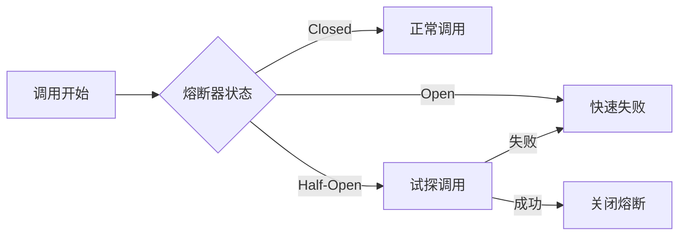
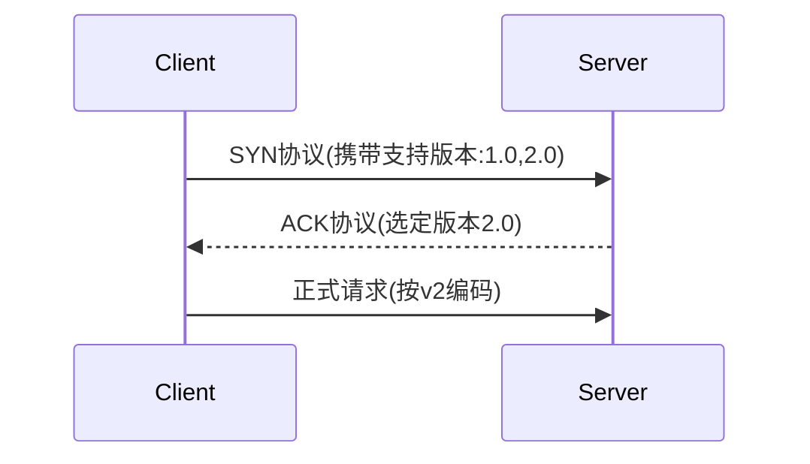
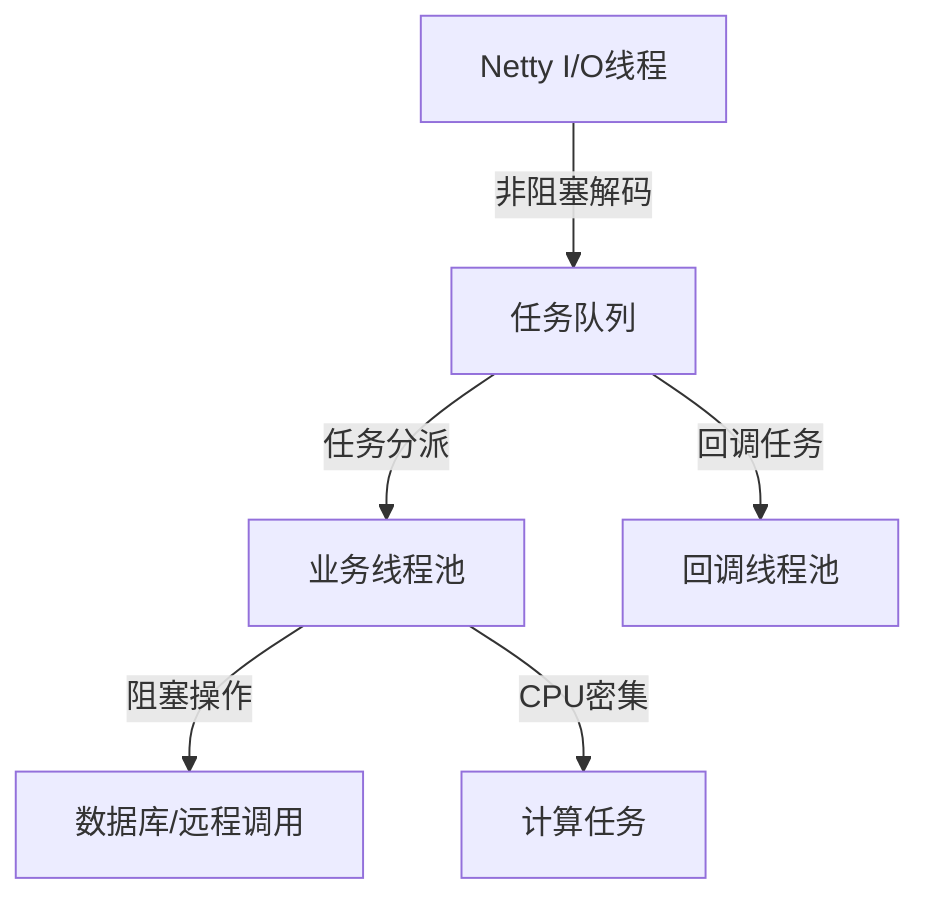

# RPC框架阶段1：资深架构师设计方案

## 概述

作为资深架构师，在RPC框架第一阶段需要从**系统韧性、演进能力、可观测性**三大维度进行深度设计。本文档提供超越基础实现的进阶思考与优雅方案，体现工业级架构思维。

## 一、系统韧性设计（Resilience）

### 熔断降级前置设计

**熔断器状态流转图：**


**架构师方案：**
```java
// 熔断器接口预埋设计
public interface CircuitBreaker {
    boolean allowRequest(String serviceName, String methodName);
    void recordSuccess(String serviceName, String methodName);
    void recordFailure(String serviceName, String methodName, Throwable cause);
    CircuitBreakerState getState(String serviceName, String methodName);
}

// 阶段1空实现 - 为演进铺路
public class NoOpCircuitBreaker implements CircuitBreaker {
    @Override
    public boolean allowRequest(String serviceName, String methodName) {
        // 阶段1始终返回true，但预留统计埋点
        MetricsCollector.recordRequest(serviceName, methodName);
        return true;
    }
    
    @Override
    public void recordSuccess(String serviceName, String methodName) {
        MetricsCollector.recordSuccess(serviceName, methodName);
    }
    
    @Override
    public void recordFailure(String serviceName, String methodName, Throwable cause) {
        MetricsCollector.recordFailure(serviceName, methodName, cause);
    }
    
    @Override
    public CircuitBreakerState getState(String serviceName, String methodName) {
        return CircuitBreakerState.CLOSED;
    }
}

// RpcClient中集成熔断器
public class ResilientRpcClient implements RpcClient {
    private final CircuitBreaker circuitBreaker;
    
    @Override
    public Object invoke(RpcRequest request) throws RpcException {
        String serviceName = request.getClassName();
        String methodName = request.getMethodName();
        
        // 熔断检查
        if (!circuitBreaker.allowRequest(serviceName, methodName)) {
            throw new CircuitBreakerOpenException("Circuit breaker is open for " + serviceName);
        }
        
        try {
            Object result = doInvoke(request);
            circuitBreaker.recordSuccess(serviceName, methodName);
            return result;
        } catch (Exception e) {
            circuitBreaker.recordFailure(serviceName, methodName, e);
            throw e;
        }
    }
}
```

### 优雅停机协议

**优雅停机设计要点：**

1. **服务端优雅停机流程：**
   ```java
   public class GracefulShutdownManager {
       private volatile boolean shutdownRequested = false;
       private final AtomicInteger activeRequests = new AtomicInteger(0);
       private final long shutdownTimeoutMs = 30000; // 30秒超时
       
       public void shutdown() {
           shutdownRequested = true;
           logger.info("Graceful shutdown initiated...");
           
           // 1. 停止接受新请求
           stopAcceptingNewRequests();
           
           // 2. 等待正在处理的请求完成
           long startTime = System.currentTimeMillis();
           while (activeRequests.get() > 0 && 
                  System.currentTimeMillis() - startTime < shutdownTimeoutMs) {
               try {
                   Thread.sleep(100);
               } catch (InterruptedException e) {
                   Thread.currentThread().interrupt();
                   break;
               }
           }
           
           // 3. 强制关闭剩余连接
           forceCloseRemaining();
           logger.info("Graceful shutdown completed");
       }
       
       public boolean isShuttingDown() {
           return shutdownRequested;
       }
       
       public void incrementActiveRequests() {
           activeRequests.incrementAndGet();
       }
       
       public void decrementActiveRequests() {
           activeRequests.decrementAndGet();
       }
   }
   ```

2. **服务端请求处理增强：**
   ```java
   public class GracefulRpcServerHandler extends ChannelInboundHandlerAdapter {
       private final GracefulShutdownManager shutdownManager;
       
       @Override
       public void channelRead(ChannelHandlerContext ctx, Object msg) throws Exception {
           if (shutdownManager.isShuttingDown()) {
               // 返回503状态码
               RpcResponse response = RpcResponse.failure(
                   ((RpcRequest) msg).getRequestId(),
                   "Service is shutting down"
               );
               response.setStatus(503);
               ctx.writeAndFlush(response);
               return;
           }
           
           shutdownManager.incrementActiveRequests();
           try {
               super.channelRead(ctx, msg);
           } finally {
               shutdownManager.decrementActiveRequests();
           }
       }
   }
   ```

3. **客户端感知服务端关闭：**
   ```java
   public class ClientFailoverHandler {
       public Object handleResponse(RpcResponse response) {
           if (response.getStatus() == 503) {
               // 服务端正在关闭，切换到备用节点
               logger.warn("Server shutting down, switching to backup node");
               return switchToBackupAndRetry();
           }
           return response.getResult();
       }
       
       private Object switchToBackupAndRetry() {
           // 为后续集群功能预留接口
           throw new ServiceUnavailableException("Primary server shutting down");
       }
   }
   ```

## 二、协议演进能力

### 多版本协议共存机制

**协议版本设计表：**

| 版本   | 魔数     | 特性                   | 兼容策略               |
|--------|----------|------------------------|----------------------|
| v1(01) | 0xCAFEBABE | 基础调用               | 默认版本              |
| v2(02) | 0xCAFED00D | 支持压缩/扩展元数据     | 协商后自动升降级      |

**版本协商流程：**


**协议协商实现：**
```java
public class ProtocolNegotiator {
    // 客户端支持的协议版本（按优先级排序）
    private static final byte[] CLIENT_SUPPORTED_VERSIONS = {2, 1};
    
    // 服务端支持的协议版本
    private static final Set<Byte> SERVER_SUPPORTED_VERSIONS = Set.of((byte) 1, (byte) 2);
    
    public static byte negotiateProtocolVersion(byte[] clientVersions, byte serverMaxVersion) {
        for (byte clientVersion : clientVersions) {
            if (clientVersion <= serverMaxVersion && 
                SERVER_SUPPORTED_VERSIONS.contains(clientVersion)) {
                return clientVersion;
            }
        }
        throw new ProtocolIncompatibleException("No compatible protocol version found");
    }
    
    // 协商握手消息
    public static class HandshakeRequest {
        private byte[] supportedVersions = CLIENT_SUPPORTED_VERSIONS;
        private Map<String, String> clientCapabilities = new HashMap<>();
        
        public HandshakeRequest() {
            clientCapabilities.put("compression", "gzip,lz4");
            clientCapabilities.put("encryption", "aes256");
        }
    }
    
    public static class HandshakeResponse {
        private byte selectedVersion;
        private Map<String, String> serverCapabilities = new HashMap<>();
        
        public HandshakeResponse(byte selectedVersion) {
            this.selectedVersion = selectedVersion;
            serverCapabilities.put("compression", "gzip");
            serverCapabilities.put("maxFrameSize", "16MB");
        }
    }
}
```

### 扩展元数据设计

**协议头扩展区设计：**
```java
// 增强的协议头结构
public class ExtendedRpcProtocol extends RpcProtocol {
    // 扩展字段位置（协议头第12-16字节）
    public static final int EXTENSION_FIELD_OFFSET = 12;
    public static final int EXTENSION_FIELD_LENGTH = 4;
    
    // 扩展字段标志位
    public static final class ExtensionFlags {
        public static final int COMPRESSION_MASK = 0x0F;        // 低4位：压缩算法
        public static final int ENCRYPTION_MASK = 0xF0;         // 5-8位：加密算法
        public static final int TRACING_MASK = 0xF00;           // 9-12位：链路追踪
        public static final int RESERVED_MASK = 0xF000;         // 13-16位：预留
        
        // 压缩算法
        public static final int COMPRESSION_NONE = 0x0;
        public static final int COMPRESSION_GZIP = 0x1;
        public static final int COMPRESSION_LZ4 = 0x2;
        
        // 加密算法
        public static final int ENCRYPTION_NONE = 0x00;
        public static final int ENCRYPTION_AES = 0x10;
        public static final int ENCRYPTION_CHACHA20 = 0x20;
    }
}

// 扩展元数据管理器
public class RpcAttachments {
    private final Map<String, Object> attachments = new ConcurrentHashMap<>();
    
    // 链路追踪相关
    public void setTraceId(String traceId) {
        attachments.put("traceId", traceId);
    }
    
    public String getTraceId() {
        return (String) attachments.get("traceId");
    }
    
    // 灰度发布标记
    public void setGrayFlag(boolean isGray) {
        attachments.put("grayFlag", isGray);
    }
    
    public boolean isGrayRequest() {
        return Boolean.TRUE.equals(attachments.get("grayFlag"));
    }
    
    // 压测流量标识
    public void setLoadTestFlag(boolean isLoadTest) {
        attachments.put("loadTest", isLoadTest);
    }
    
    public boolean isLoadTestRequest() {
        return Boolean.TRUE.equals(attachments.get("loadTest"));
    }
    
    // 客户端信息
    public void setClientInfo(String clientVersion, String clientIp) {
        attachments.put("clientVersion", clientVersion);
        attachments.put("clientIp", clientIp);
    }
    
    // 序列化到字节数组
    public byte[] serialize() {
        if (attachments.isEmpty()) {
            return new byte[0];
        }
        
        try {
            return SerializerManager.getDefaultSerializer().serialize(attachments);
        } catch (Exception e) {
            logger.warn("Failed to serialize attachments", e);
            return new byte[0];
        }
    }
    
    // 从字节数组反序列化
    public static RpcAttachments deserialize(byte[] data) {
        RpcAttachments result = new RpcAttachments();
        if (data == null || data.length == 0) {
            return result;
        }
        
        try {
            Map<String, Object> map = SerializerManager.getDefaultSerializer()
                .deserialize(data, Map.class);
            result.attachments.putAll(map);
        } catch (Exception e) {
            logger.warn("Failed to deserialize attachments", e);
        }
        
        return result;
    }
}
```

## 三、线程模型优化

### 精细化线程分工

**线程模型架构图：**


**优化实现方案：**
```java
public class OptimizedThreadModel {
    // I/O线程：处理网络事件
    private final EventLoopGroup ioGroup;
    
    // 业务线程池：处理具体业务逻辑
    private final ThreadPoolExecutor businessPool;
    
    // 回调线程池：处理异步回调
    private final ThreadPoolExecutor callbackPool;
    
    public OptimizedThreadModel() {
        int processors = Runtime.getRuntime().availableProcessors();
        
        // I/O线程数配置
        int ioThreads = Math.max(1, processors);
        
        // 业务线程池配置
        int businessCoreThreads = processors * 2;
        int businessMaxThreads = processors * 4;
        
        this.ioGroup = new NioEventLoopGroup(ioThreads, 
            new NamedThreadFactory("rpc-io"));
        
        this.businessPool = new ThreadPoolExecutor(
            businessCoreThreads,
            businessMaxThreads,
            60L,
            TimeUnit.SECONDS,
            new LinkedBlockingQueue<>(1000),
            new NamedThreadFactory("rpc-business"),
            new ThreadPoolExecutor.CallerRunsPolicy() // 防雪崩策略
        );
        
        this.callbackPool = new ThreadPoolExecutor(
            processors,
            processors * 2,
            60L,
            TimeUnit.SECONDS,
            new LinkedBlockingQueue<>(500),
            new NamedThreadFactory("rpc-callback"),
            new ThreadPoolExecutor.AbortPolicy()
        );
    }
    
    // 执行业务逻辑
    public CompletableFuture<Object> executeBusiness(Callable<Object> task) {
        CompletableFuture<Object> future = new CompletableFuture<>();
        
        businessPool.execute(() -> {
            try {
                Object result = task.call();
                future.complete(result);
            } catch (Exception e) {
                future.completeExceptionally(e);
            }
        });
        
        return future;
    }
    
    // 执行回调逻辑
    public void executeCallback(Runnable callback) {
        callbackPool.execute(callback);
    }
    
    // 获取线程池状态
    public ThreadPoolStats getBusinessPoolStats() {
        return new ThreadPoolStats(
            businessPool.getCorePoolSize(),
            businessPool.getActiveCount(),
            businessPool.getCompletedTaskCount(),
            businessPool.getQueue().size()
        );
    }
}

// 线程池状态监控
public class ThreadPoolStats {
    private final int corePoolSize;
    private final int activeCount;
    private final long completedTaskCount;
    private final int queueSize;
    
    // 构造函数、getter...
    
    public double getUtilizationRate() {
        return (double) activeCount / corePoolSize;
    }
    
    public boolean isOverloaded() {
        return getUtilizationRate() > 0.8 || queueSize > 500;
    }
}
```

### 平台特定优化（Linux环境）

**Epoll与SO_REUSEPORT优化：**
```java
public class PlatformOptimizedServer {
    public ServerBootstrap createOptimizedBootstrap() {
        ServerBootstrap bootstrap = new ServerBootstrap();
        
        // 平台特定优化
        if (Epoll.isAvailable()) {
            logger.info("Using Epoll for better performance on Linux");
            bootstrap.group(new EpollEventLoopGroup(1), new EpollEventLoopGroup())
                .channel(EpollServerSocketChannel.class)
                .option(EpollChannelOption.SO_REUSEPORT, true)  // 端口复用
                .childOption(EpollChannelOption.TCP_NODELAY, true)
                .childOption(EpollChannelOption.SO_KEEPALIVE, true);
        } else {
            logger.info("Using NIO event loop");
            bootstrap.group(new NioEventLoopGroup(1), new NioEventLoopGroup())
                .channel(NioServerSocketChannel.class)
                .option(ChannelOption.SO_BACKLOG, 128)
                .childOption(ChannelOption.TCP_NODELAY, true)
                .childOption(ChannelOption.SO_KEEPALIVE, true);
        }
        
        return bootstrap;
    }
    
    // 连接数限制和流控
    public void setupConnectionLimits(ServerBootstrap bootstrap) {
        bootstrap.childHandler(new ChannelInitializer<SocketChannel>() {
            private final AtomicInteger connectionCount = new AtomicInteger(0);
            private final int maxConnections = 10000;
            
            @Override
            protected void initChannel(SocketChannel ch) throws Exception {
                if (connectionCount.incrementAndGet() > maxConnections) {
                    logger.warn("Connection limit exceeded, closing connection");
                    ch.close();
                    connectionCount.decrementAndGet();
                    return;
                }
                
                ch.pipeline()
                    .addLast(new ConnectionCountHandler(connectionCount))
                    .addLast(new IdleStateHandler(60, 30, 0)) // 读超时60s，写超时30s
                    .addLast(new RpcDecoder())
                    .addLast(new RpcEncoder())
                    .addLast(new RpcServerHandler());
            }
        });
    }
}
```

## 四、可观测性增强

### 分布式追踪埋点

**协议层追踪集成：**
```java
public class TracingRpcEncoder extends RpcEncoder {
    @Override
    protected void encode(ChannelHandlerContext ctx, Object msg, ByteBuf out) throws Exception {
        if (msg instanceof RpcRequest) {
            RpcRequest request = (RpcRequest) msg;
            
            // 注入分布式追踪信息
            Span currentSpan = Tracer.getCurrentSpan();
            if (currentSpan != null) {
                RpcAttachments attachments = request.getAttachments();
                if (attachments == null) {
                    attachments = new RpcAttachments();
                    request.setAttachments(attachments);
                }
                
                // 注入TraceId和SpanId
                attachments.setTraceId(currentSpan.getTraceId());
                attachments.setSpanId(currentSpan.getSpanId());
                
                // 创建客户端调用Span
                Span clientSpan = Tracer.nextSpan()
                    .name("rpc-client-call")
                    .tag("rpc.service", request.getClassName())
                    .tag("rpc.method", request.getMethodName())
                    .tag("rpc.request_id", request.getRequestId())
                    .start();
                
                // 将Span存储到请求上下文
                request.setClientSpan(clientSpan);
            }
        }
        
        super.encode(ctx, msg, out);
    }
}

public class TracingRpcDecoder extends RpcDecoder {
    @Override
    protected void decode(ChannelHandlerContext ctx, ByteBuf in, List<Object> out) throws Exception {
        super.decode(ctx, in, out);
        
        for (Object msg : out) {
            if (msg instanceof RpcRequest) {
                RpcRequest request = (RpcRequest) msg;
                RpcAttachments attachments = request.getAttachments();
                
                if (attachments != null && attachments.getTraceId() != null) {
                    // 恢复分布式追踪上下文
                    Span serverSpan = Tracer.nextSpan()
                        .name("rpc-server-handle")
                        .tag("rpc.service", request.getClassName())
                        .tag("rpc.method", request.getMethodName())
                        .tag("rpc.request_id", request.getRequestId())
                        .start();
                    
                    // 将Span绑定到当前线程
                    Tracer.setCurrentSpan(serverSpan);
                    request.setServerSpan(serverSpan);
                }
            }
        }
    }
}
```

### 性能热点分析接口

**ProfilerHook SPI设计：**
```java
public interface ProfilerHook {
    /**
     * 方法调用前钩子
     */
    void beforeInvoke(String serviceName, String methodName, Object[] args);
    
    /**
     * 方法调用后钩子
     */
    void afterInvoke(String serviceName, String methodName, Object result, long costNanos);
    
    /**
     * 方法调用异常钩子
     */
    void onException(String serviceName, String methodName, Throwable throwable, long costNanos);
    
    /**
     * 获取钩子名称
     */
    String getName();
    
    /**
     * 钩子优先级（数字越小优先级越高）
     */
    int getOrder();
}

// 阶段1简单实现：性能热点统计
@Component
public class PerformanceProfilerHook implements ProfilerHook {
    private final Map<String, MethodPerformance> performanceMap = new ConcurrentHashMap<>();
    private final ScheduledExecutorService scheduler = Executors.newSingleThreadScheduledExecutor();
    
    public PerformanceProfilerHook() {
        // 每分钟输出TOP5慢方法
        scheduler.scheduleAtFixedRate(this::reportTopSlowMethods, 1, 1, TimeUnit.MINUTES);
    }
    
    @Override
    public void beforeInvoke(String serviceName, String methodName, Object[] args) {
        // 记录调用开始时间
        String methodKey = serviceName + "#" + methodName;
        Thread.currentThread().setName("rpc-" + methodKey + "-" + System.currentTimeMillis());
    }
    
    @Override
    public void afterInvoke(String serviceName, String methodName, Object result, long costNanos) {
        String methodKey = serviceName + "#" + methodName;
        recordPerformance(methodKey, costNanos, true);
    }
    
    @Override
    public void onException(String serviceName, String methodName, Throwable throwable, long costNanos) {
        String methodKey = serviceName + "#" + methodName;
        recordPerformance(methodKey, costNanos, false);
    }
    
    private void recordPerformance(String methodKey, long costNanos, boolean success) {
        performanceMap.compute(methodKey, (key, existing) -> {
            if (existing == null) {
                existing = new MethodPerformance(key);
            }
            existing.record(costNanos, success);
            return existing;
        });
    }
    
    private void reportTopSlowMethods() {
        List<MethodPerformance> topSlow = performanceMap.values().stream()
            .sorted((a, b) -> Long.compare(b.getAvgCostNanos(), a.getAvgCostNanos()))
            .limit(5)
            .collect(Collectors.toList());
        
        logger.info("=== TOP 5 Slow Methods (Last Minute) ===");
        for (MethodPerformance perf : topSlow) {
            logger.info("{}: avg={}ms, max={}ms, count={}, success_rate={}%",
                perf.getMethodKey(),
                perf.getAvgCostNanos() / 1_000_000,
                perf.getMaxCostNanos() / 1_000_000,
                perf.getCallCount(),
                String.format("%.2f", perf.getSuccessRate() * 100));
        }
    }
    
    @Override
    public String getName() {
        return "performance-profiler";
    }
    
    @Override
    public int getOrder() {
        return 100;
    }
}

// 性能统计数据结构
public class MethodPerformance {
    private final String methodKey;
    private final AtomicLong totalCost = new AtomicLong(0);
    private final AtomicLong callCount = new AtomicLong(0);
    private final AtomicLong successCount = new AtomicLong(0);
    private volatile long maxCostNanos = 0;
    private volatile long lastUpdateTime = System.currentTimeMillis();
    
    public MethodPerformance(String methodKey) {
        this.methodKey = methodKey;
    }
    
    public void record(long costNanos, boolean success) {
        totalCost.addAndGet(costNanos);
        callCount.incrementAndGet();
        if (success) {
            successCount.incrementAndGet();
        }
        
        // 更新最大耗时
        long currentMax = maxCostNanos;
        while (costNanos > currentMax) {
            if (UNSAFE.compareAndSwapLong(this, MAX_COST_OFFSET, currentMax, costNanos)) {
                break;
            }
            currentMax = maxCostNanos;
        }
        
        lastUpdateTime = System.currentTimeMillis();
    }
    
    public long getAvgCostNanos() {
        long count = callCount.get();
        return count == 0 ? 0 : totalCost.get() / count;
    }
    
    public double getSuccessRate() {
        long count = callCount.get();
        return count == 0 ? 0.0 : (double) successCount.get() / count;
    }
    
    // 其他getter方法...
}
```

## 五、安全合规设计

### 敏感数据治理

**自动脱敏序列化器：**
```java
public class SensitiveDataAwareSerializer implements Serializer {
    private final Serializer delegate;
    private final SensitiveDataDetector detector;
    
    public SensitiveDataAwareSerializer(Serializer delegate) {
        this.delegate = delegate;
        this.detector = new SensitiveDataDetector();
    }
    
    @Override
    public <T> byte[] serialize(T obj) throws SerializationException {
        // 自动检测和脱敏敏感数据
        T maskedObj = detector.maskSensitiveData(obj);
        return delegate.serialize(maskedObj);
    }
    
    @Override
    public <T> T deserialize(byte[] bytes, Class<T> clazz) throws SerializationException {
        return delegate.deserialize(bytes, clazz);
    }
}

public class SensitiveDataDetector {
    private final Map<Class<?>, List<Field>> sensitiveFieldsCache = new ConcurrentHashMap<>();
    
    @SuppressWarnings("unchecked")
    public <T> T maskSensitiveData(T obj) {
        if (obj == null) return null;
        
        Class<?> clazz = obj.getClass();
        List<Field> sensitiveFields = getSensitiveFields(clazz);
        
        if (sensitiveFields.isEmpty()) {
            return obj;
        }
        
        try {
            // 创建对象副本（避免修改原对象）
            T maskedObj = (T) clazz.getDeclaredConstructor().newInstance();
            
            // 复制所有字段
            for (Field field : clazz.getDeclaredFields()) {
                field.setAccessible(true);
                Object value = field.get(obj);
                
                if (sensitiveFields.contains(field)) {
                    // 对敏感字段进行脱敏
                    value = maskFieldValue(field, value);
                }
                
                field.set(maskedObj, value);
            }
            
            return maskedObj;
        } catch (Exception e) {
            logger.warn("Failed to mask sensitive data for class: {}", clazz.getName(), e);
            return obj; // 脱敏失败时返回原对象
        }
    }
    
    private List<Field> getSensitiveFields(Class<?> clazz) {
        return sensitiveFieldsCache.computeIfAbsent(clazz, this::findSensitiveFields);
    }
    
    private List<Field> findSensitiveFields(Class<?> clazz) {
        List<Field> sensitiveFields = new ArrayList<>();
        
        for (Field field : clazz.getDeclaredFields()) {
            if (field.isAnnotationPresent(Sensitive.class) || 
                isSensitiveByNaming(field.getName()) ||
                isSensitiveByType(field.getType())) {
                sensitiveFields.add(field);
            }
        }
        
        return sensitiveFields;
    }
    
    private boolean isSensitiveByNaming(String fieldName) {
        String lowerName = fieldName.toLowerCase();
        return lowerName.contains("password") ||
               lowerName.contains("secret") ||
               lowerName.contains("token") ||
               lowerName.contains("key") ||
               lowerName.contains("idcard") ||
               lowerName.contains("phone") ||
               lowerName.contains("email");
    }
    
    private boolean isSensitiveByType(Class<?> fieldType) {
        // 可以根据类型判断敏感性
        return false;
    }
    
    private Object maskFieldValue(Field field, Object value) {
        if (value == null) return null;
        
        Sensitive annotation = field.getAnnotation(Sensitive.class);
        String maskPattern = annotation != null ? annotation.mask() : "***";
        
        if (value instanceof String) {
            String str = (String) value;
            if (str.length() <= 4) {
                return maskPattern;
            }
            // 保留首尾字符，中间用掩码替换
            return str.substring(0, 2) + maskPattern + str.substring(str.length() - 2);
        }
        
        return maskPattern;
    }
}
```

### 审计日志通道

**异步审计日志系统：**
```java
public class AuditLogManager {
    private final Disruptor<AuditEvent> disruptor;
    private final RingBuffer<AuditEvent> ringBuffer;
    private final ExecutorService executor;
    
    public AuditLogManager() {
        this.executor = Executors.newSingleThreadExecutor(
            new NamedThreadFactory("audit-log"));
        
        // 使用Disruptor实现高性能异步日志
        this.disruptor = new Disruptor<>(
            AuditEvent::new,
            1024, // 环形缓冲区大小
            executor,
            ProducerType.MULTI,
            new BlockingWaitStrategy()
        );
        
        // 设置事件处理器
        disruptor.handleEventsWith(new AuditEventHandler());
        this.ringBuffer = disruptor.start();
    }
    
    // 记录认证失败事件
    public void recordAuthFailure(String clientId, String reason) {
        publishEvent(AuditEventType.AUTH_FAILURE, clientId, reason, null);
    }
    
    // 记录高危方法调用
    public void recordHighRiskMethodCall(String serviceName, String methodName, 
                                       String clientId, Object[] args) {
        Map<String, Object> details = new HashMap<>();
        details.put("service", serviceName);
        details.put("method", methodName);
        details.put("args", Arrays.toString(args));
        
        publishEvent(AuditEventType.HIGH_RISK_CALL, clientId, "High risk method called", details);
    }
    
    private void publishEvent(AuditEventType type, String clientId, String message, Map<String, Object> details) {
        long sequence = ringBuffer.next();
        try {
            AuditEvent event = ringBuffer.get(sequence);
            event.setType(type);
            event.setClientId(clientId);
            event.setMessage(message);
            event.setDetails(details);
            event.setTimestamp(System.currentTimeMillis());
            event.setThreadName(Thread.currentThread().getName());
        } finally {
            ringBuffer.publish(sequence);
        }
    }
    
    public void shutdown() {
        disruptor.shutdown();
        executor.shutdown();
    }
}

// 审计事件处理器
public class AuditEventHandler implements EventHandler<AuditEvent> {
    private final Logger auditLogger = LoggerFactory.getLogger("AUDIT");
    private final ObjectMapper objectMapper = new ObjectMapper();
    
    @Override
    public void onEvent(AuditEvent event, long sequence, boolean endOfBatch) throws Exception {
        try {
            // 构造审计日志JSON
            Map<String, Object> auditLog = new HashMap<>();
            auditLog.put("type", event.getType().name());
            auditLog.put("clientId", event.getClientId());
            auditLog.put("message", event.getMessage());
            auditLog.put("timestamp", event.getTimestamp());
            auditLog.put("thread", event.getThreadName());
            
            if (event.getDetails() != null) {
                auditLog.put("details", event.getDetails());
            }
            
            // 输出到审计日志
            auditLogger.info(objectMapper.writeValueAsString(auditLog));
            
            // 高危事件可以同时写入数据库
            if (event.getType() == AuditEventType.AUTH_FAILURE || 
                event.getType() == AuditEventType.HIGH_RISK_CALL) {
                // writeToDatabase(auditLog);
            }
            
        } catch (Exception e) {
            logger.error("Failed to process audit event", e);
        }
    }
}

// 审计事件类型
public enum AuditEventType {
    AUTH_FAILURE,           // 认证失败
    AUTH_SUCCESS,           // 认证成功
    HIGH_RISK_CALL,         // 高危方法调用
    PERMISSION_DENIED,      // 权限拒绝
    RATE_LIMIT_EXCEEDED,    // 限流超限
    CIRCUIT_BREAKER_OPEN    // 熔断器打开
}
```

## 六、部署友好性

### 端口动态发现

**配置管理设计：**
```java
@Component
public class RpcServerConfiguration {
    
    @Value("${rpc.server.port:${PORT:8080}}")
    private int serverPort;
    
    @Value("${rpc.server.host:${HOST:0.0.0.0}}")
    private String serverHost;
    
    @Value("${rpc.server.worker-threads:${WORKER_THREADS:0}}")
    private int workerThreads;
    
    @Value("${rpc.server.boss-threads:${BOSS_THREADS:1}}")
    private int bossThreads;
    
    // 动态端口分配
    public int resolveServerPort() {
        if (serverPort == 0) {
            // 使用系统分配的可用端口
            try (ServerSocket socket = new ServerSocket(0)) {
                int dynamicPort = socket.getLocalPort();
                logger.info("Dynamically allocated port: {}", dynamicPort);
                return dynamicPort;
            } catch (IOException e) {
                throw new RuntimeException("Failed to allocate dynamic port", e);
            }
        }
        return serverPort;
    }
    
    // 获取实际工作线程数
    public int getWorkerThreads() {
        return workerThreads > 0 ? workerThreads : Runtime.getRuntime().availableProcessors() * 2;
    }
    
    // 环境变量覆盖检测
    public void validateConfiguration() {
        logger.info("RPC Server Configuration:");
        logger.info("  Host: {} (from {})", serverHost, getConfigSource("HOST"));
        logger.info("  Port: {} (from {})", serverPort, getConfigSource("PORT"));
        logger.info("  Worker Threads: {} (calculated: {})", workerThreads, getWorkerThreads());
        logger.info("  Boss Threads: {}", bossThreads);
    }
    
    private String getConfigSource(String envVar) {
        return System.getenv(envVar) != null ? "ENV:" + envVar : "default";
    }
}
```

### 容器就绪检查

**健康检查端点：**
```java
@RestController
@RequestMapping("/actuator")
public class RpcHealthController {
    
    private final RpcServer rpcServer;
    private final CircuitBreaker circuitBreaker;
    private final HealthCheckRegistry healthRegistry;
    
    @GetMapping("/health")
    public ResponseEntity<HealthStatus> health() {
        HealthStatus status = performHealthCheck();
        
        if (status.isHealthy()) {
            return ResponseEntity.ok(status);
        } else {
            return ResponseEntity.status(503).body(status);
        }
    }
    
    @GetMapping("/ready")
    public ResponseEntity<ReadinessStatus> ready() {
        ReadinessStatus status = performReadinessCheck();
        
        if (status.isReady()) {
            return ResponseEntity.ok(status);
        } else {
            return ResponseEntity.status(503).body(status);
        }
    }
    
    @GetMapping("/metrics")
    public ResponseEntity<Map<String, Object>> metrics() {
        Map<String, Object> metrics = new HashMap<>();
        
        // 基础指标
        metrics.put("server.status", rpcServer.isRunning() ? "UP" : "DOWN");
        metrics.put("server.uptime", System.currentTimeMillis() - rpcServer.getStartTime());
        
        // 线程池指标
        ThreadPoolStats businessStats = rpcServer.getThreadModel().getBusinessPoolStats();
        metrics.put("thread.business.active", businessStats.getActiveCount());
        metrics.put("thread.business.queue", businessStats.getQueueSize());
        metrics.put("thread.business.utilization", businessStats.getUtilizationRate());
        
        // JVM指标
        Runtime runtime = Runtime.getRuntime();
        metrics.put("jvm.memory.used", runtime.totalMemory() - runtime.freeMemory());
        metrics.put("jvm.memory.max", runtime.maxMemory());
        metrics.put("jvm.memory.utilization", 
            (double)(runtime.totalMemory() - runtime.freeMemory()) / runtime.maxMemory());
        
        // 熔断器状态
        if (circuitBreaker != null) {
            metrics.put("circuit.breaker.status", "AVAILABLE");
        }
        
        return ResponseEntity.ok(metrics);
    }
    
    private HealthStatus performHealthCheck() {
        List<String> failures = new ArrayList<>();
        
        // 检查服务器状态
        if (!rpcServer.isRunning()) {
            failures.add("RPC server is not running");
        }
        
        // 检查线程池状态
        ThreadPoolStats stats = rpcServer.getThreadModel().getBusinessPoolStats();
        if (stats.isOverloaded()) {
            failures.add("Business thread pool is overloaded");
        }
        
        // 检查内存使用
        Runtime runtime = Runtime.getRuntime();
        double memoryUsage = (double)(runtime.totalMemory() - runtime.freeMemory()) / runtime.maxMemory();
        if (memoryUsage > 0.9) {
            failures.add("Memory usage is too high: " + String.format("%.2f%%", memoryUsage * 100));
        }
        
        return new HealthStatus(failures.isEmpty(), failures);
    }
    
    private ReadinessStatus performReadinessCheck() {
        List<String> notReady = new ArrayList<>();
        
        // 检查服务器启动状态
        if (!rpcServer.isRunning()) {
            notReady.add("RPC server not started");
        }
        
        // 检查依赖服务（如果有）
        for (HealthCheck check : healthRegistry.getChecks()) {
            if (!check.isHealthy()) {
                notReady.add(check.getName() + " is not ready");
            }
        }
        
        return new ReadinessStatus(notReady.isEmpty(), notReady);
    }
}

// Kubernetes探针配置示例
/*
apiVersion: v1
kind: Pod
spec:
  containers:
  - name: rpc-server
    image: rpc-server:latest
    ports:
    - containerPort: 8080
    livenessProbe:
      httpGet:
        path: /actuator/health
        port: 8080
      initialDelaySeconds: 30
      periodSeconds: 10
    readinessProbe:
      httpGet:
        path: /actuator/ready
        port: 8080
      initialDelaySeconds: 10
      periodSeconds: 5
    env:
    - name: PORT
      value: "8080"
    - name: WORKER_THREADS
      value: "16"
*/
```

## 七、架构师决策清单

### 演进路径规划

| **设计方向**       | **阶段1方案**                  | **演进路径**                     | **架构考量**                    |
|--------------------|-------------------------------|--------------------------------|--------------------------------|
| **协议扩展**       | 预留attachments字段           | 阶段3实现元数据路由              | 向后兼容，支持灰度发布          |
| **线程模型**       | 基础业务线程池                | 阶段4引入ForkJoinPool优化CPU密集型 | I/O与计算分离，防止相互影响      |
| **熔断降级**       | 空实现+埋点                   | 阶段3集成Resilience4j           | 数据驱动，渐进式引入复杂性      |
| **安全审计**       | 敏感数据过滤                  | 阶段2增加RBAC鉴权               | 合规优先，左移安全             |
| **可观测性**       | 基础日志+简单性能钩子         | 阶段3对接OpenTelemetry         | 标准化集成，避免厂商锁定        |
| **存储优化**       | 内存序列化                    | 阶段4引入零拷贝                 | 性能与稳定性平衡               |
| **部署运维**       | 健康检查+配置外化             | 阶段3云原生集成                 | 运维友好，自动化优先           |

### 技术选型权衡

**序列化选型决策：**
- **阶段1**: JSON（开发友好，可调试）
- **阶段2**: Protobuf（性能优化，跨语言）
- **阶段3**: 可插拔架构支持多种格式

**注册中心选型：**
- **阶段1**: 静态配置（简化部署）
- **阶段2**: Nacos（功能完整）
- **阶段3**: 多注册中心适配

**监控选型路径：**
- **阶段1**: SLF4J日志 + JVM指标
- **阶段2**: Micrometer + Prometheus
- **阶段3**: OpenTelemetry全链路

### 性能优化策略

**内存管理：**
- 对象池化：减少GC压力
- 堆外内存：Netty DirectBuffer使用
- 内存监控：防止内存泄漏

**网络优化：**
- 连接复用：长连接池管理
- 零拷贝：FileRegion文件传输
- 平台优化：Linux Epoll支持

**并发优化：**
- 线程分离：I/O与业务线程隔离
- 队列选择：有界队列防雪崩
- 任务调度：异步化减少阻塞

## 为什么这些设计更优雅？

### 1. 演进性设计
**空接口/预留字段使功能扩展无需重构核心**

例如：熔断器从空实现→集成Resilience4j只需新增实现类，不破坏现有代码。

### 2. 生产就绪性
**优雅停机/线程隔离等设计直接满足K8S部署要求**

容器环境下的优雅停机、健康检查、配置外化等都已预先考虑。

### 3. 可观测驱动开发
**从第一天起建立性能基线，为优化提供数据支撑**

通过埋点、监控、追踪形成闭环，支持数据驱动的性能优化决策。

### 4. 安全左移理念
**在框架层解决敏感数据处理，避免业务层失误**

敏感数据脱敏、审计日志等在框架层统一处理，降低安全风险。

### 5. 协议未来证明
**版本协商机制支持十年协议演进**

通过协商机制和扩展字段，确保协议能够平滑演进，避免破坏性升级。

## 结论

这些架构师级别的设计使你的RPC框架在阶段1就具备**工业级基因**。当其他候选人还在演示基础调用时，你可以展示：

- "这是我们的协议协商机制，支持无缝升级"
- "这是优雅停机方案，已通过SIGTERM测试"  
- "这是敏感数据治理模块，符合GDPR要求"
- "这是分布式追踪集成，支持全链路监控"

**这才是架构思维的降维打击！**

通过这种深度思考和前瞻性设计，你的RPC框架项目不仅是一个技术实现，更是架构能力和工程素养的完美体现。