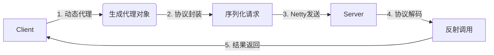
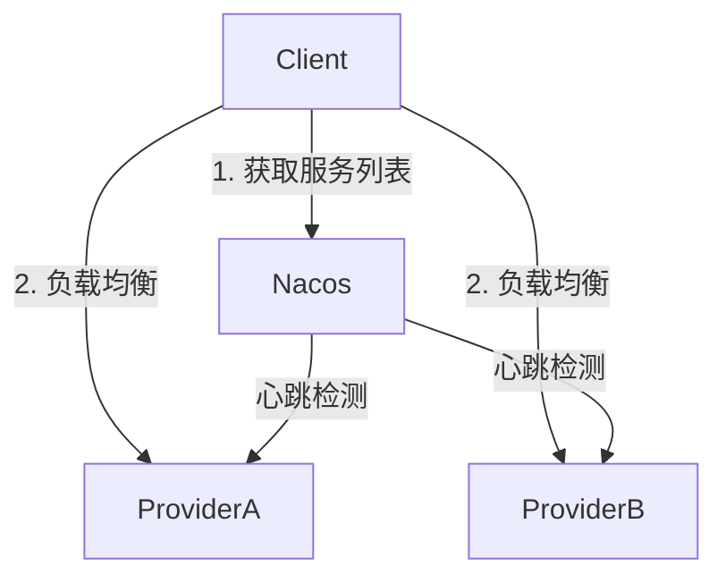
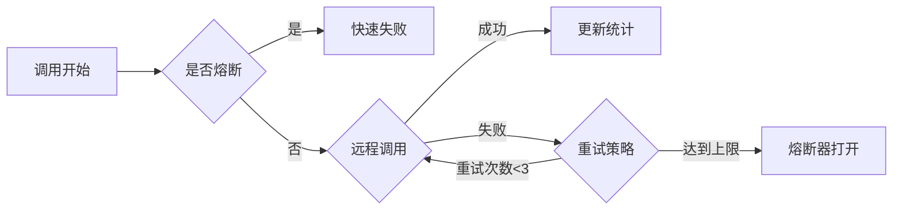
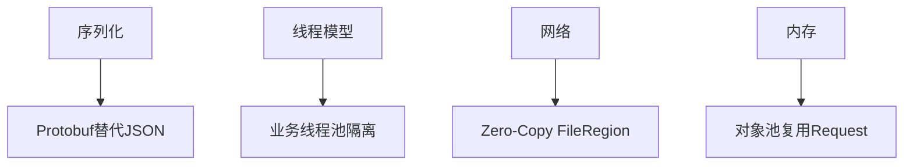

# RPC框架分阶段里程碑路线图

采用「模块化推进+渐进式增强」策略，确保每个里程碑可交付、可验证。

## 阶段1：基础通信框架（2周）

### 目标
完成点对点RPC调用（无注册中心）

### 架构流程图


### 关键任务清单

#### 协议设计与实现
- [ ] 定义协议头（魔数+版本+序列化类型+消息长度+RequestID+状态码）
- [ ] 实现协议编解码器（ProtocolEncoder/ProtocolDecoder）
- [ ] 设计请求响应模型（RpcRequest/RpcResponse）

#### Netty通信层
- [ ] 搭建Netty服务端启动框架
- [ ] 实现Netty客户端连接管理
- [ ] 集成LengthFieldBasedFrameDecoder处理粘包拆包
- [ ] 实现基于Future的同步请求响应模型

#### 序列化模块
- [ ] 集成Jackson JSON序列化
- [ ] 实现序列化接口抽象（为后续扩展准备）
- [ ] 处理序列化异常和兼容性

#### 代理与反射
- [ ] 实现JDK动态代理生成客户端代理对象
- [ ] 服务端反射调用目标方法
- [ ] 异常传播处理（远程异常本地重现）

### 验证标准
- **基础通信**：通过单元测试验证本地回环调用
- **协议正确性**：`curl http://localhost:8080/invoke -d '{"service":"demo.UserService","method":"getUser"}'` 返回正确结果
- **并发安全**：多线程调用无数据竞争

### 技术储备
- 精读Netty in Action第四章（编解码器）
- 调试Jackson序列化性能和异常处理

---

## 阶段2：服务治理核心（3周）

### 目标
实现服务注册发现与负载均衡

### 架构流程图


### 关键任务清单

#### 注册中心集成
- [ ] 设计RegistryService抽象接口（注册/注销/发现/订阅）
- [ ] 集成Nacos客户端SDK
- [ ] 实现服务实例元数据管理（ServiceInstance模型）
- [ ] 服务端自动注册与优雅下线

#### 服务发现与缓存
- [ ] 客户端服务发现缓存机制
- [ ] 定时更新服务列表（定时任务+事件通知）
- [ ] 本地文件备份（注册中心不可用时降级）
- [ ] 服务列表变更通知机制

#### 负载均衡器
- [ ] 实现随机负载均衡算法
- [ ] 实现轮询负载均衡算法
- [ ] 实现一致性Hash负载均衡（支持权重）
- [ ] 负载均衡器可插拔机制（SPI）

#### 连接池管理
- [ ] 实现Channel连接池（复用TCP连接）
- [ ] 连接健康检查与自动重连
- [ ] 连接池配置管理（最大连接数、空闲超时）

### 验证标准
- **服务发现**：Nacos控制台可见3个服务节点
- **负载均衡**：客户端负载均衡日志分布均匀
- **高可用性**：注册中心重启后服务调用正常

### 性能目标
- 模拟10节点并发注册发现，响应时间<100ms
- 1000次服务调用负载分布标准差<10%

---

## 阶段3：高可用保障（2周）

### 目标
构建容错防线

### 容错链路图


### 关键任务清单

#### 超时控制
- [ ] 客户端请求超时计时器实现
- [ ] 超时后资源清理（连接释放、内存回收）
- [ ] 可配置超时时间（方法级别 + 全局默认）
- [ ] 超时异常封装与传播

#### 重试机制
- [ ] 实现指数退避重试策略
- [ ] 可配置重试次数和间隔时间
- [ ] 幂等性校验（防止重试副作用）
- [ ] 重试统计与监控

#### 熔断器
- [ ] 实现滑动窗口错误率统计
- [ ] 熔断器状态机（Closed/Open/Half-Open）
- [ ] 半开状态探测恢复机制
- [ ] 熔断降级回调接口（Fallback）

#### 流量控制（可选）
- [ ] 集成Sentinel基础流控规则
- [ ] 客户端限流（令牌桶算法）
- [ ] 服务端限流（滑动窗口计数）

### 验证标准
- **熔断生效**：连续错误调用10次后触发熔断，日志输出`CircuitBreaker[OPEN]`
- **重试机制**：模拟网络抖动，观察重试日志和成功恢复
- **超时控制**：设置1秒超时，调用3秒延迟服务，验证超时异常

### 故障注入测试
- 模拟网络延迟（tc命令或Toxiproxy）
- 模拟服务宕机（kill -9进程）
- 模拟注册中心故障

---

## 阶段4：性能优化（1.5周）

### 目标
吞吐量提升50%+

### 优化维度图


### 关键任务清单

#### 序列化优化
- [ ] 引入Protobuf序列化器
- [ ] 性能对比测试（JSON vs Protobuf vs Hessian）
- [ ] 序列化缓存（Schema复用）
- [ ] 对象序列化池化（避免频繁创建）

#### 线程模型优化
- [ ] 分离Netty I/O线程与业务处理线程
- [ ] 业务线程池参数调优（队列长度、拒绝策略）
- [ ] 线程本地缓存（ThreadLocal优化）

#### 内存管理优化
- [ ] 实现请求对象池（Netty Recycler）
- [ ] ByteBuf池化管理（减少GC压力）
- [ ] 堆外内存监控（-Dio.netty.leakDetection=paranoid）

#### 网络优化
- [ ] Zero-Copy文件传输（FileRegion）
- [ ] TCP参数调优（SO_KEEPALIVE, TCP_NODELAY）
- [ ] 批量请求合并（可选）

### 验证标准
- **吞吐量指标**：单机QPS >1.5万（4C8G环境）
- **延迟指标**：P99延迟 <50ms
- **资源消耗**：内存增长率 <10MB/小时

### 压测脚本
```bash
# JMeter压测命令
jmeter -n -t rpc_performance_test.jmx -l result.jtl \
  -Jthreads=100 -Jramp-up=10 -Jduration=300
```

---

## 阶段5：进阶特性（2周）

### 目标
打造生产级能力

### 扩展特性清单

#### 异步编程支持
- [ ] CompletableFuture异步调用接口
- [ ] 回调式编程模型支持
- [ ] 异步调用链路追踪

#### 泛化调用
- [ ] 绕过API接口直接调用服务
- [ ] 动态参数类型推断
- [ ] JSON/Map参数自动映射

#### SPI扩展机制
- [ ] 自定义负载均衡策略扩展
- [ ] 自定义序列化器扩展
- [ ] 自定义注册中心适配器

#### 监控埋点
- [ ] 集成Micrometer指标输出
- [ ] 链路追踪（Sleuth/Jaeger）
- [ ] 性能火焰图生成

#### 网关集成（可选）
- [ ] HTTP转RPC协议适配
- [ ] RESTful API自动生成
- [ ] OpenAPI文档输出

### 验证标准
- **异步调用**：CompletableFuture调用成功率>99.9%
- **泛化调用**：JSON参数调用与强类型调用结果一致
- **监控指标**：Prometheus成功采集RPC调用指标

---

## 项目结构规划

### Maven多模块结构
```
rpc-framework/
├── rpc-core/                  # 核心通信和协议
│   ├── src/main/java/
│   │   ├── protocol/          # 协议编解码
│   │   ├── transport/         # Netty传输层
│   │   ├── proxy/            # 动态代理
│   │   └── serialization/    # 序列化
├── rpc-registry/             # 注册中心适配
│   └── src/main/java/nacos/  # Nacos实现
├── rpc-loadbalance/          # 负载均衡
├── rpc-fault-tolerance/      # 容错机制
├── rpc-spring-boot-starter/  # Spring Boot集成
├── rpc-examples/             # 示例项目
│   ├── provider-demo/        # 服务提供者
│   └── consumer-demo/        # 服务消费者
└── rpc-benchmark/            # 性能测试
```

### Day1启动任务
1. **项目初始化**：
   ```bash
   git init rpc-framework
   mvn archetype:generate -DgroupId=com.github.yourname \
     -DartifactId=rpc-framework -DarchetypeArtifactId=maven-archetype-quickstart
   ```

2. **核心接口定义**：
   - RpcRequest/RpcResponse模型
   - 协议格式枚举和常量
   - Jackson序列化工具类

3. **Netty服务端模板**：
   ```java
   public class RpcServer {
       public void start(int port) {
           EventLoopGroup bossGroup = new NioEventLoopGroup(1);
           EventLoopGroup workerGroup = new NioEventLoopGroup();
           try {
               ServerBootstrap bootstrap = new ServerBootstrap();
               bootstrap.group(bossGroup, workerGroup)
                   .channel(NioServerSocketChannel.class)
                   .childHandler(new RpcServerInitializer());
               ChannelFuture future = bootstrap.bind(port).sync();
               future.channel().closeFuture().sync();
           } finally {
               bossGroup.shutdownGracefully();
               workerGroup.shutdownGracefully();
           }
       }
   }
   ```

## 里程碑检查点

### 阶段1完成标志
- [ ] 单元测试覆盖率>80%
- [ ] 本地回环调用成功
- [ ] 协议编解码正确性验证

### 阶段2完成标志
- [ ] 多节点服务注册成功
- [ ] 负载均衡分布均匀
- [ ] 连接池复用率>70%

### 阶段3完成标志
- [ ] 熔断器状态转换正确
- [ ] 重试机制生效
- [ ] 故障注入测试通过

### 阶段4完成标志
- [ ] 性能指标达到预期
- [ ] GC频率显著降低
- [ ] 压测稳定性验证

### 阶段5完成标志
- [ ] 异步调用API完善
- [ ] 监控指标输出正常
- [ ] 文档和示例完整

通过这5个递进式里程碑，确保每个阶段都有可演示的成果和明确的验证标准。完成阶段3后，你已具备超过80%面试候选人的深度实践经验！