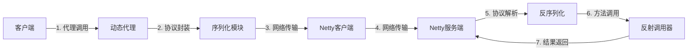
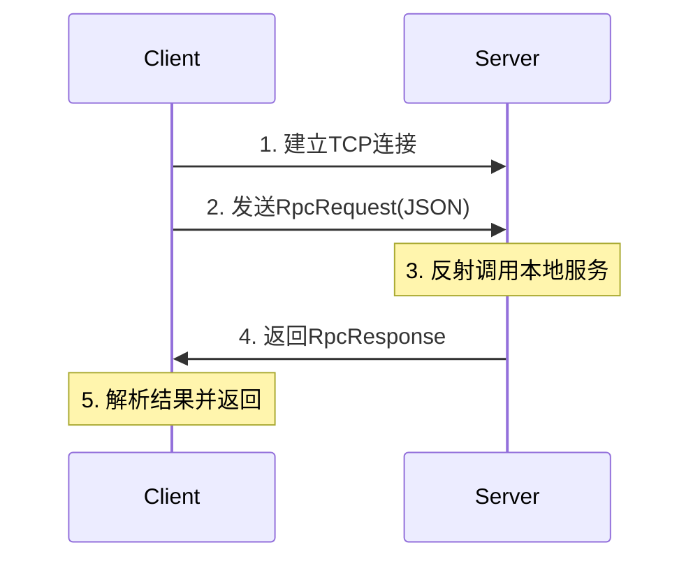

# RPC框架阶段1：基础通信框架设计蓝图

## 设计目标

**核心功能**：在不依赖注册中心的前提下，实现客户端通过接口方法透明调用远程服务  
**技术指标**：单机可运行、支持同步阻塞调用、基础序列化、网络通信可靠

## 核心架构设计



## 协议设计（通信基石）

### 协议头结构（12字节）

```
+-------+--------+-------+--------+----------+--------+
| Magic | Version| Codec | MsgType|  Length  | Reserved|
|  4B   |   1B   |  1B   |   1B   |    4B    |   1B   |
+-------+--------+-------+--------+----------+--------+
0       4        5       6        7          11       12
```

**字段说明：**
- **Magic (0-3字节)**: 魔数 `0xCAFEBABE` - 快速识别无效报文
- **Version (4字节)**: 协议版本 `01` - 兼容性控制
- **Codec (5字节)**: 序列化类型 `0=JSON, 1=Protobuf, 2=Hessian`
- **MsgType (6字节)**: 消息类型 `0=请求, 1=响应`
- **Length (7-10字节)**: 消息体长度 - 解决粘包问题
- **Reserved (11字节)**: 预留字段 - 未来扩展使用

### 消息体结构

**请求体格式：**
```json
{
  "requestId": "550e8400-e29b-41d4-a716-446655440000",
  "className": "com.example.UserService",
  "methodName": "getUser",
  "parameterTypes": ["java.lang.Long"],
  "parameters": [123],
  "version": "1.0.0"
}
```

**响应体格式：**
```json
{
  "requestId": "550e8400-e29b-41d4-a716-446655440000",
  "status": 200,
  "result": {
    "id": 123,
    "name": "张三",
    "email": "zhangsan@example.com"
  },
  "exception": null,
  "timestamp": 1642752000000
}
```

**状态码定义：**
- `200`: 调用成功
- `400`: 请求参数错误
- `404`: 方法不存在
- `500`: 服务端内部错误

## 动态代理（透明化调用）

### 实现原理

**代理生成流程：**
1. 客户端通过`Proxy.newProxyInstance`生成接口代理对象
2. 代理持有服务端地址(IP:Port)和连接管理器
3. 方法调用拦截逻辑：
   - 构造RPC请求对象（类名/方法名/参数）
   - 委托给`NettyClient`发送请求
   - **同步阻塞**等待响应（`CountDownLatch`或`CompletableFuture`）

### 核心接口设计

```java
// 代理工厂接口
public interface RpcProxyFactory {
    <T> T createProxy(Class<T> serviceInterface, String serverHost, int serverPort);
}

// 代理调用处理器
public class RpcInvocationHandler implements InvocationHandler {
    private final RpcClient rpcClient;
    private final String serverHost;
    private final int serverPort;
    
    @Override
    public Object invoke(Object proxy, Method method, Object[] args) throws Throwable {
        // 1. 构造RPC请求
        RpcRequest request = buildRequest(method, args);
        
        // 2. 发送请求并等待响应
        RpcResponse response = rpcClient.sendRequest(request, serverHost, serverPort);
        
        // 3. 处理响应结果
        return handleResponse(response, method.getReturnType());
    }
}
```

### 关键注意事项

- **类型处理**：需要处理基本类型、包装类型、集合类型、自定义对象
- **异常传播**：远程异常需要在本地重新抛出
- **超时控制**：设置合理的调用超时时间
- **连接管理**：代理对象可复用，但需要管理底层连接生命周期

## 网络通信（Netty核心）

### 客户端实现

**Bootstrap配置：**
```java
public class NettyRpcClient {
    private Bootstrap bootstrap;
    private EventLoopGroup eventLoopGroup;
    
    public void init() {
        eventLoopGroup = new NioEventLoopGroup(1);
        bootstrap = new Bootstrap()
            .group(eventLoopGroup)
            .channel(NioSocketChannel.class)
            .option(ChannelOption.SO_KEEPALIVE, true)
            .option(ChannelOption.TCP_NODELAY, true)
            .option(ChannelOption.CONNECT_TIMEOUT_MILLIS, 5000);
    }
}
```

**Handler链配置：**
```
LoggingHandler → LengthFieldPrepender → RpcEncoder → RpcDecoder → RpcClientHandler
```

**同步调用机制：**
- 请求发送前创建`ResponseFuture`（含`requestId`和`CountDownLatch`）
- 将future存入`ConcurrentHashMap<String, ResponseFuture>`
- 响应到达时通过`requestId`匹配future并唤醒等待线程

### 服务端实现

**ServerBootstrap配置：**
```java
public class NettyRpcServer {
    private ServerBootstrap serverBootstrap;
    private EventLoopGroup bossGroup;
    private EventLoopGroup workerGroup;
    
    public void start(int port) {
        bossGroup = new NioEventLoopGroup(1);
        workerGroup = new NioEventLoopGroup(Runtime.getRuntime().availableProcessors() * 2);
        
        serverBootstrap = new ServerBootstrap()
            .group(bossGroup, workerGroup)
            .channel(NioServerSocketChannel.class)
            .childOption(ChannelOption.TCP_NODELAY, true)
            .childOption(ChannelOption.SO_KEEPALIVE, true);
    }
}
```

**Handler链配置：**
```
LengthFieldBasedFrameDecoder → RpcDecoder → RpcServerHandler → RpcEncoder
```

**反射调用器设计：**
```java
public class ServiceInvoker {
    // 服务实例容器
    private final Map<String, Object> serviceMap = new ConcurrentHashMap<>();
    
    // 注册服务实例
    public void registerService(String serviceName, Object serviceImpl) {
        serviceMap.put(serviceName, serviceImpl);
    }
    
    // 反射调用服务方法
    public Object invoke(RpcRequest request) throws Exception {
        Object serviceImpl = serviceMap.get(request.getClassName());
        if (serviceImpl == null) {
            throw new ServiceNotFoundException("Service not found: " + request.getClassName());
        }
        
        Class<?> serviceClass = serviceImpl.getClass();
        Method method = serviceClass.getMethod(
            request.getMethodName(), 
            request.getParameterTypes()
        );
        
        return method.invoke(serviceImpl, request.getParameters());
    }
}
```

## 序列化模块（可扩展设计）

### 序列化接口抽象

```java
public interface Serializer {
    /**
     * 序列化对象为字节数组
     */
    <T> byte[] serialize(T obj) throws SerializationException;
    
    /**
     * 反序列化字节数组为对象
     */
    <T> T deserialize(byte[] bytes, Class<T> clazz) throws SerializationException;
    
    /**
     * 获取序列化器类型
     */
    byte getCodecType();
}
```

### JSON序列化实现

```java
public class JsonSerializer implements Serializer {
    private static final ObjectMapper OBJECT_MAPPER = new ObjectMapper();
    
    static {
        // 配置ObjectMapper
        OBJECT_MAPPER.configure(DeserializationFeature.FAIL_ON_UNKNOWN_PROPERTIES, false);
        OBJECT_MAPPER.configure(SerializationFeature.FAIL_ON_EMPTY_BEANS, false);
        OBJECT_MAPPER.setDateFormat(new SimpleDateFormat("yyyy-MM-dd HH:mm:ss"));
    }
    
    @Override
    public <T> byte[] serialize(T obj) throws SerializationException {
        try {
            return OBJECT_MAPPER.writeValueAsBytes(obj);
        } catch (JsonProcessingException e) {
            throw new SerializationException("JSON serialization failed", e);
        }
    }
    
    @Override
    public <T> T deserialize(byte[] bytes, Class<T> clazz) throws SerializationException {
        try {
            return OBJECT_MAPPER.readValue(bytes, clazz);
        } catch (IOException e) {
            throw new SerializationException("JSON deserialization failed", e);
        }
    }
    
    @Override
    public byte getCodecType() {
        return 0; // JSON类型
    }
}
```

### 序列化管理器

```java
public class SerializerManager {
    private static final Map<Byte, Serializer> SERIALIZERS = new ConcurrentHashMap<>();
    private static volatile Serializer defaultSerializer;
    
    static {
        registerSerializer(new JsonSerializer());
        defaultSerializer = new JsonSerializer();
    }
    
    public static void registerSerializer(Serializer serializer) {
        SERIALIZERS.put(serializer.getCodecType(), serializer);
    }
    
    public static Serializer getSerializer(byte codecType) {
        return SERIALIZERS.get(codecType);
    }
    
    public static Serializer getDefaultSerializer() {
        return defaultSerializer;
    }
}
```

## 编解码器实现

### RPC编码器

```java
public class RpcEncoder extends MessageToByteEncoder<Object> {
    
    @Override
    protected void encode(ChannelHandlerContext ctx, Object msg, ByteBuf out) throws Exception {
        // 1. 确定消息类型和序列化器
        byte codecType = 0; // 默认JSON
        Serializer serializer = SerializerManager.getSerializer(codecType);
        
        // 2. 序列化消息体
        byte[] bodyBytes = serializer.serialize(msg);
        
        // 3. 写入协议头
        out.writeInt(RpcProtocol.MAGIC_NUMBER);           // 魔数
        out.writeByte(RpcProtocol.VERSION);               // 版本
        out.writeByte(codecType);                         // 序列化类型
        out.writeByte(getMessageType(msg));               // 消息类型
        out.writeInt(bodyBytes.length);                   // 消息长度
        out.writeByte(0);                                 // 预留字段
        
        // 4. 写入消息体
        out.writeBytes(bodyBytes);
    }
    
    private byte getMessageType(Object msg) {
        return msg instanceof RpcRequest ? (byte) 0 : (byte) 1;
    }
}
```

### RPC解码器

```java
public class RpcDecoder extends ByteToMessageDecoder {
    
    @Override
    protected void decode(ChannelHandlerContext ctx, ByteBuf in, List<Object> out) throws Exception {
        // 1. 检查协议头长度
        if (in.readableBytes() < RpcProtocol.HEADER_LENGTH) {
            return;
        }
        
        // 2. 标记读位置
        in.markReaderIndex();
        
        // 3. 读取并验证魔数
        int magicNumber = in.readInt();
        if (magicNumber != RpcProtocol.MAGIC_NUMBER) {
            in.resetReaderIndex();
            throw new RpcException("Invalid magic number: " + magicNumber);
        }
        
        // 4. 读取协议头其他字段
        byte version = in.readByte();
        byte codecType = in.readByte();
        byte messageType = in.readByte();
        int bodyLength = in.readInt();
        byte reserved = in.readByte();
        
        // 5. 检查消息体长度
        if (in.readableBytes() < bodyLength) {
            in.resetReaderIndex();
            return;
        }
        
        // 6. 读取消息体
        byte[] bodyBytes = new byte[bodyLength];
        in.readBytes(bodyBytes);
        
        // 7. 反序列化消息
        Serializer serializer = SerializerManager.getSerializer(codecType);
        Object message = deserializeMessage(serializer, messageType, bodyBytes);
        
        out.add(message);
    }
    
    private Object deserializeMessage(Serializer serializer, byte messageType, byte[] bodyBytes) {
        if (messageType == 0) {
            return serializer.deserialize(bodyBytes, RpcRequest.class);
        } else {
            return serializer.deserialize(bodyBytes, RpcResponse.class);
        }
    }
}
```

## 同步等待机制

### ResponseFuture设计

```java
public class ResponseFuture {
    private final String requestId;
    private final long createTime;
    private final int timeoutMs;
    private final CountDownLatch latch = new CountDownLatch(1);
    
    private volatile RpcResponse response;
    private volatile boolean done = false;
    
    public ResponseFuture(String requestId, int timeoutMs) {
        this.requestId = requestId;
        this.timeoutMs = timeoutMs;
        this.createTime = System.currentTimeMillis();
    }
    
    public RpcResponse get() throws InterruptedException, TimeoutException {
        return get(timeoutMs, TimeUnit.MILLISECONDS);
    }
    
    public RpcResponse get(long timeout, TimeUnit unit) throws InterruptedException, TimeoutException {
        boolean success = latch.await(timeout, unit);
        if (!success) {
            throw new TimeoutException("Request timeout after " + timeout + " " + unit);
        }
        return response;
    }
    
    public void setResponse(RpcResponse response) {
        this.response = response;
        this.done = true;
        latch.countDown();
    }
    
    // getter方法...
}
```

### Future管理器

```java
public class ResponseFutureManager {
    private static final Map<String, ResponseFuture> FUTURE_MAP = new ConcurrentHashMap<>();
    
    // 定时清理超时的Future
    private static final ScheduledExecutorService SCHEDULER = 
        Executors.newSingleThreadScheduledExecutor(r -> {
            Thread t = new Thread(r, "ResponseFuture-Cleaner");
            t.setDaemon(true);
            return t;
        });
    
    static {
        // 每5秒清理一次超时的Future
        SCHEDULER.scheduleAtFixedRate(() -> {
            cleanTimeoutFutures();
        }, 0, 5, TimeUnit.SECONDS);
    }
    
    public static void addFuture(ResponseFuture future) {
        FUTURE_MAP.put(future.getRequestId(), future);
    }
    
    public static ResponseFuture getFuture(String requestId) {
        return FUTURE_MAP.get(requestId);
    }
    
    public static ResponseFuture removeFuture(String requestId) {
        return FUTURE_MAP.remove(requestId);
    }
    
    private static void cleanTimeoutFutures() {
        long currentTime = System.currentTimeMillis();
        FUTURE_MAP.entrySet().removeIf(entry -> {
            ResponseFuture future = entry.getValue();
            return currentTime - future.getCreateTime() > future.getTimeoutMs();
        });
    }
}
```

## 关键技术要点

### 1. Netty粘包/拆包处理

```java
// 服务端pipeline配置
pipeline.addLast("frameDecoder", new LengthFieldBasedFrameDecoder(
    65536,    // maxFrameLength: 最大帧长度
    7,        // lengthFieldOffset: 长度字段偏移量
    4,        // lengthFieldLength: 长度字段长度
    0,        // lengthAdjustment: 长度调整值
    11        // initialBytesToStrip: 跳过的字节数
));
```

### 2. 线程模型选择

**客户端配置：**
- 单EventLoopGroup：`new NioEventLoopGroup(1)`
- 适用于客户端连接数较少的场景

**服务端配置：**
- BossGroup：`new NioEventLoopGroup(1)` - 处理连接接收
- WorkerGroup：`new NioEventLoopGroup(CPU核数 * 2)` - 处理IO事件

### 3. 资源释放策略

```java
public class RpcServerHandler extends ChannelInboundHandlerAdapter {
    @Override
    public void channelRead(ChannelHandlerContext ctx, Object msg) throws Exception {
        try {
            // 处理消息
            processMessage(ctx, msg);
        } finally {
            // 释放ByteBuf资源
            ReferenceCountUtil.release(msg);
        }
    }
    
    @Override
    public void channelReadComplete(ChannelHandlerContext ctx) throws Exception {
        ctx.flush(); // 刷新输出缓冲区
    }
    
    @Override
    public void exceptionCaught(ChannelHandlerContext ctx, Throwable cause) throws Exception {
        logger.error("Channel exception caught", cause);
        ctx.close(); // 关闭连接
    }
}
```

### 4. 超时控制机制

```java
public class TimeoutHandler {
    private final ScheduledExecutorService scheduler = 
        Executors.newSingleThreadScheduledExecutor();
    
    public void addTimeout(String requestId, int timeoutMs, Runnable timeoutCallback) {
        scheduler.schedule(() -> {
            ResponseFuture future = ResponseFutureManager.getFuture(requestId);
            if (future != null && !future.isDone()) {
                ResponseFutureManager.removeFuture(requestId);
                timeoutCallback.run();
            }
        }, timeoutMs, TimeUnit.MILLISECONDS);
    }
}
```

## 阶段验证方案

### 验证时序图



### 验证用例设计

**1. 基本功能验证：**
```java
@Test
public void testBasicRpcCall() {
    // 启动服务端
    RpcServer server = new RpcServer();
    server.registerService(UserService.class.getName(), new UserServiceImpl());
    server.start(8080);
    
    // 创建客户端代理
    RpcClient client = new RpcClient();
    UserService userService = client.createProxy(UserService.class, "localhost", 8080);
    
    // 调用远程方法
    User user = userService.getUser(123L);
    
    // 验证结果
    assertNotNull(user);
    assertEquals(123L, user.getId());
}
```

**2. 异常场景验证：**
```java
@Test(expected = RpcException.class)
public void testMethodNotFound() {
    // 调用不存在的方法
    userService.nonExistentMethod();
}

@Test(expected = TimeoutException.class) 
public void testTimeout() {
    // 设置1秒超时
    RpcClient client = new RpcClient();
    client.setTimeout(1000);
    
    // 调用耗时3秒的方法
    slowService.slowMethod();
}
```

**3. 性能压测验证：**
```java
@Test
public void testPerformance() {
    int threadCount = 10;
    int requestPerThread = 100;
    ExecutorService executor = Executors.newFixedThreadPool(threadCount);
    
    long startTime = System.currentTimeMillis();
    
    for (int i = 0; i < threadCount; i++) {
        executor.submit(() -> {
            for (int j = 0; j < requestPerThread; j++) {
                userService.getUser((long) j);
            }
        });
    }
    
    long endTime = System.currentTimeMillis();
    long totalRequests = threadCount * requestPerThread;
    long avgRT = (endTime - startTime) / totalRequests;
    
    System.out.println("Average RT: " + avgRT + "ms");
    assertTrue("Average RT should be less than 10ms", avgRT < 10);
}
```

**4. 内存泄漏检测：**
```bash
# 启动时添加JVM参数
-XX:+PrintGC -XX:+PrintGCDetails -Xms256m -Xmx256m

# 压测1000次请求后检查
jmap -histo <pid> | grep -E "(DirectByteBuffer|RpcRequest|RpcResponse)"
```

## 下一步行动清单

### 立即开始的任务

1. **创建项目结构**
   ```
   rpc-core/
   ├── src/main/java/com/yourname/rpc/
   │   ├── protocol/          # 协议相关
   │   ├── proxy/            # 动态代理
   │   ├── transport/        # 网络传输
   │   ├── serialize/        # 序列化
   │   └── common/           # 公共组件
   ```

2. **定义核心常量**
   ```java
   public class RpcProtocol {
       public static final int MAGIC_NUMBER = 0xCAFEBABE;
       public static final byte VERSION = 1;
       public static final int HEADER_LENGTH = 12;
   }
   ```

3. **创建基础模型类**
   ```java
   public class RpcRequest { /* requestId, className, methodName, etc. */ }
   public class RpcResponse { /* requestId, status, result, exception, etc. */ }
   ```

4. **实现JSON序列化器**
   - 配置线程安全的ObjectMapper
   - 处理泛型类型转换
   - 异常处理封装

5. **开发协议编解码器**
   - LengthFieldBasedFrameDecoder参数配置
   - RpcEncoder/RpcDecoder实现
   - 协议头字段验证

### 开发优先级

**第一周：基础组件**
- [ ] 协议定义和常量类
- [ ] RpcRequest/RpcResponse模型
- [ ] JSON序列化器实现
- [ ] 基础异常类定义

**第二周：网络通信**
- [ ] Netty客户端Bootstrap配置
- [ ] Netty服务端ServerBootstrap配置
- [ ] 协议编解码器实现
- [ ] Handler链配置

**第三周：代理和调用**
- [ ] 动态代理工厂实现
- [ ] ResponseFuture同步等待机制
- [ ] 服务反射调用器
- [ ] 端到端集成测试

通过这个详细的设计蓝图，你可以清晰地理解RPC框架第一阶段的每个技术细节，为后续的代码实现奠定坚实的理论基础。