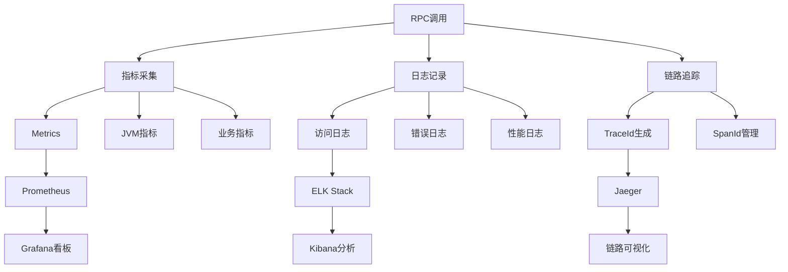

# RPC框架阶段1：生产级设计要点

## 概述

本文档是对[RPC框架阶段1设计蓝图](rpc-stage1-design-blueprint.md)的深度补充，聚焦于工程健壮性、可扩展性和生产级细节。这些往往是初学者容易忽略但实际项目中至关重要的部分。

## 一、协议设计的进阶考量

### 协议扩展性预留

**预留字段设计：**
```
+-------+--------+-------+--------+----------+--------+----------+
| Magic | Version| Codec | MsgType|  Length  |Reserved| ExtFields|
|  4B   |   1B   |  1B   |   1B   |    4B    |   1B   |    2B    |
+-------+--------+-------+--------+----------+--------+----------+
0       4        5       6        7          11       12        14
```

**扩展字段用途：**
- **Bit 0-3**: 压缩算法标识（0=无压缩, 1=Gzip, 2=LZ4）
- **Bit 4-7**: 加密类型（0=明文, 1=AES, 2=ChaCha20）
- **Bit 8-11**: 链路追踪标识（0=无追踪, 1=Jaeger, 2=Zipkin）
- **Bit 12-15**: 预留给未来使用

**版本协商机制：**
```java
public class ProtocolNegotiation {
    // 客户端支持的协议版本列表
    private static final byte[] SUPPORTED_VERSIONS = {1, 2};
    
    public static byte negotiateVersion(byte serverVersion) {
        // 选择双方都支持的最高版本
        for (int i = SUPPORTED_VERSIONS.length - 1; i >= 0; i--) {
            if (SUPPORTED_VERSIONS[i] <= serverVersion) {
                return SUPPORTED_VERSIONS[i];
            }
        }
        throw new ProtocolException("No compatible protocol version found");
    }
}
```

### 心跳协议设计

**心跳包格式：**
```java
public class HeartbeatProtocol {
    public static final byte HEARTBEAT_TYPE = 0x00;
    
    // 心跳请求（客户端 -> 服务端）
    public static class HeartbeatRequest {
        private long clientTimestamp = System.currentTimeMillis();
        private String clientId;
    }
    
    // 心跳响应（服务端 -> 客户端）
    public static class HeartbeatResponse {
        private long serverTimestamp = System.currentTimeMillis();
        private long clientTimestamp; // 回显客户端时间戳
        private int serverLoad; // 服务器负载（0-100）
    }
}
```

**心跳策略配置：**
```java
public class HeartbeatConfig {
    // 心跳发送间隔（毫秒）
    private int heartbeatInterval = 30000; // 30秒
    
    // 心跳超时时间（毫秒）
    private int heartbeatTimeout = 10000; // 10秒
    
    // 连续失败次数阈值
    private int maxFailureCount = 3;
    
    // 时钟同步阈值（毫秒）
    private long clockSyncThreshold = 5000; // 5秒
}
```

## 二、动态代理的深度优化

### 泛型方法支持

**泛型类型处理：**
```java
public class GenericTypeHandler {
    private static final Map<String, Type> TYPE_CACHE = new ConcurrentHashMap<>();
    
    public static Object deserializeWithGeneric(byte[] data, Method method) {
        Type returnType = method.getGenericReturnType();
        String typeKey = returnType.toString();
        
        // 缓存Type信息避免重复解析
        Type cachedType = TYPE_CACHE.computeIfAbsent(typeKey, k -> returnType);
        
        if (returnType instanceof ParameterizedType) {
            ParameterizedType paramType = (ParameterizedType) returnType;
            return SerializerManager.getDefaultSerializer()
                .deserializeGeneric(data, paramType);
        } else {
            return SerializerManager.getDefaultSerializer()
                .deserialize(data, (Class<?>) returnType);
        }
    }
}
```

**序列化器泛型支持：**
```java
public interface Serializer {
    // 原有方法
    <T> byte[] serialize(T obj) throws SerializationException;
    <T> T deserialize(byte[] bytes, Class<T> clazz) throws SerializationException;
    
    // 新增泛型支持方法
    Object deserializeGeneric(byte[] bytes, Type type) throws SerializationException;
}

public class JsonSerializer implements Serializer {
    @Override
    public Object deserializeGeneric(byte[] bytes, Type type) throws SerializationException {
        try {
            JavaType javaType = OBJECT_MAPPER.getTypeFactory().constructType(type);
            return OBJECT_MAPPER.readValue(bytes, javaType);
        } catch (IOException e) {
            throw new SerializationException("Generic deserialization failed", e);
        }
    }
}
```

### 方法签名冲突解决

**方法签名生成：**
```java
public class MethodSignature {
    public static String generateMethodSign(Method method) {
        StringBuilder sb = new StringBuilder();
        sb.append(method.getName()).append("(");
        
        Class<?>[] paramTypes = method.getParameterTypes();
        for (int i = 0; i < paramTypes.length; i++) {
            if (i > 0) sb.append(",");
            sb.append(paramTypes[i].getName());
        }
        sb.append(")");
        
        // 生成SHA1哈希避免签名过长
        return DigestUtils.sha1Hex(sb.toString());
    }
}
```

**增强的RpcRequest：**
```java
public class RpcRequest implements Serializable {
    // 原有字段...
    private String requestId;
    private String className;
    private String methodName;
    private Class<?>[] parameterTypes;
    private Object[] parameters;
    
    // 新增字段
    private String methodSignature; // 方法签名哈希
    private Map<String, Object> attachments; // 附加信息
    private long timeout = 5000; // 超时时间
    
    // 工厂方法
    public static RpcRequest create(String className, Method method, Object[] args) {
        RpcRequest request = new RpcRequest();
        request.setRequestId(UUIDUtil.generateId());
        request.setClassName(className);
        request.setMethodName(method.getName());
        request.setParameterTypes(method.getParameterTypes());
        request.setParameters(args);
        request.setMethodSignature(MethodSignature.generateMethodSign(method));
        return request;
    }
}
```

### 异步调用前置设计

**RpcContext设计：**
```java
public class RpcContext {
    private static final ThreadLocal<RpcContext> LOCAL = new ThreadLocal<>();
    
    private String traceId;
    private String clientId;
    private Map<String, Object> attachments = new HashMap<>();
    private long startTime = System.currentTimeMillis();
    
    public static RpcContext getContext() {
        RpcContext context = LOCAL.get();
        if (context == null) {
            context = new RpcContext();
            LOCAL.set(context);
        }
        return context;
    }
    
    public static void removeContext() {
        LOCAL.remove();
    }
    
    // 链路追踪支持
    public void setTraceId(String traceId) {
        this.traceId = traceId;
        MDC.put("traceId", traceId); // SLF4J MDC支持
    }
}
```

**异步接口预留：**
```java
public interface AsyncRpcClient {
    // 同步调用（第一阶段实现）
    <T> T createProxy(Class<T> serviceInterface, String serverHost, int serverPort);
    
    // 异步调用接口（预留给后续阶段）
    <T> CompletableFuture<T> invokeAsync(RpcRequest request);
    
    // 回调式调用（预留）
    void invokeCallback(RpcRequest request, RpcCallback<Object> callback);
}
```

## 三、网络层的生产级加固

### 连接管理策略

**连接管理策略对比：**

| **策略**          | **实现方案**                                  | **适用场景**       | **性能** | **复杂度** |
|-------------------|---------------------------------------------|------------------|----------|-----------|
| 短连接模式          | 每次请求新建连接（简单但性能差）                 | 开发测试阶段        | 低       | 低        |
| **长连接池**       | 维护`ChannelPool`复用连接（需心跳保活）         | **生产推荐**      | 高       | 中        |
| 连接预热           | 启动时初始化最小连接数                          | 避免首请求延迟      | 高       | 高        |

**连接池实现：**
```java
public class ChannelPool {
    private final String serverAddress;
    private final Queue<Channel> availableChannels = new ConcurrentLinkedQueue<>();
    private final AtomicInteger totalChannels = new AtomicInteger(0);
    private final int maxConnections;
    private final int minConnections;
    
    public ChannelPool(String serverAddress, int minConnections, int maxConnections) {
        this.serverAddress = serverAddress;
        this.minConnections = minConnections;
        this.maxConnections = maxConnections;
        
        // 预热连接
        preWarmConnections();
    }
    
    public Channel acquire() throws InterruptedException {
        Channel channel = availableChannels.poll();
        if (channel == null || !channel.isActive()) {
            if (totalChannels.get() < maxConnections) {
                return createNewChannel();
            } else {
                // 等待可用连接或超时
                return waitForAvailableChannel();
            }
        }
        return channel;
    }
    
    public void release(Channel channel) {
        if (channel != null && channel.isActive()) {
            availableChannels.offer(channel);
        } else {
            totalChannels.decrementAndGet();
        }
    }
    
    private void preWarmConnections() {
        for (int i = 0; i < minConnections; i++) {
            try {
                Channel channel = createNewChannel();
                availableChannels.offer(channel);
            } catch (Exception e) {
                logger.warn("Failed to pre-warm connection", e);
            }
        }
    }
}
```

### 异常处理矩阵

**异常处理策略表：**

| **异常类型**         | **处理策略**                                  | **响应码** | **客户端行为** |
|---------------------|---------------------------------------------|-----------|---------------|
| 解码失败             | 立即关闭连接并发送`RpcResponse(status=400)`  | 400       | 抛出协议异常   |
| 服务方法不存在        | 返回`RpcResponse(status=404)`               | 404       | 抛出方法未找到异常 |
| 方法执行异常         | 捕获异常并封装到`RpcResponse.exception`      | 500       | 重新抛出业务异常 |
| 网络超时             | 客户端抛出`RpcTimeoutException`              | N/A       | 根据重试策略处理 |
| 连接中断             | 客户端自动重试（可配置次数）                  | N/A       | 自动重连      |

**异常处理器实现：**
```java
public class RpcExceptionHandler {
    private static final Logger logger = LoggerFactory.getLogger(RpcExceptionHandler.class);
    
    public RpcResponse handleException(RpcRequest request, Throwable throwable) {
        String requestId = request.getRequestId();
        RpcResponse response = new RpcResponse(requestId);
        
        if (throwable instanceof IllegalArgumentException) {
            response.setStatus(RpcProtocol.Status.BAD_REQUEST);
            response.setException("Invalid request parameters: " + throwable.getMessage());
        } else if (throwable instanceof NoSuchMethodException) {
            response.setStatus(RpcProtocol.Status.NOT_FOUND);
            response.setException("Method not found: " + request.getMethodName());
        } else if (throwable instanceof SecurityException) {
            response.setStatus(RpcProtocol.Status.FORBIDDEN);
            response.setException("Access denied");
        } else {
            response.setStatus(RpcProtocol.Status.INTERNAL_ERROR);
            response.setException("Internal server error: " + throwable.getMessage());
            
            // 记录详细错误日志
            logger.error("RPC method execution failed: {}.{}()", 
                request.getClassName(), request.getMethodName(), throwable);
        }
        
        return response;
    }
}
```

### 内存保护机制

**帧长度保护：**
```java
public class ProtocolLimits {
    // 最大帧长度（1MB）
    public static final int MAX_FRAME_LENGTH = 1024 * 1024;
    
    // 最大方法参数数量
    public static final int MAX_PARAMETER_COUNT = 256;
    
    // 最大字符串长度
    public static final int MAX_STRING_LENGTH = 65535;
    
    // 最大集合大小
    public static final int MAX_COLLECTION_SIZE = 10000;
}

public class SecureRpcDecoder extends RpcDecoder {
    @Override
    protected void decode(ChannelHandlerContext ctx, ByteBuf in, List<Object> out) throws Exception {
        // 调用父类解码
        super.decode(ctx, in, out);
        
        // 额外的安全检查
        for (Object msg : out) {
            if (msg instanceof RpcRequest) {
                validateRequest((RpcRequest) msg);
            }
        }
    }
    
    private void validateRequest(RpcRequest request) throws SecurityException {
        // 检查参数数量
        if (request.getParameters() != null && 
            request.getParameters().length > ProtocolLimits.MAX_PARAMETER_COUNT) {
            throw new SecurityException("Too many parameters");
        }
        
        // 检查字符串长度
        validateStringLength(request.getClassName());
        validateStringLength(request.getMethodName());
    }
}
```

**反序列化白名单：**
```java
public class SerializationSecurityManager {
    private static final Set<String> ALLOWED_PACKAGES = new HashSet<>();
    private static final Set<String> BLOCKED_CLASSES = new HashSet<>();
    
    static {
        // 允许的包前缀
        ALLOWED_PACKAGES.add("com.yourcompany.");
        ALLOWED_PACKAGES.add("java.lang.");
        ALLOWED_PACKAGES.add("java.util.");
        
        // 禁止的危险类
        BLOCKED_CLASSES.add("java.lang.ProcessBuilder");
        BLOCKED_CLASSES.add("java.lang.Runtime");
        BLOCKED_CLASSES.add("java.io.FileInputStream");
    }
    
    public static void checkClass(String className) throws SecurityException {
        if (BLOCKED_CLASSES.contains(className)) {
            throw new SecurityException("Blocked class: " + className);
        }
        
        boolean allowed = ALLOWED_PACKAGES.stream()
            .anyMatch(className::startsWith);
        
        if (!allowed) {
            throw new SecurityException("Class not in whitelist: " + className);
        }
    }
}
```

## 四、可观测性设计

### 监控体系架构



### 核心监控指标

**客户端指标：**
```java
@Component
public class ClientMetrics {
    private final MeterRegistry meterRegistry;
    
    // 请求计数器
    private final Counter requestCounter;
    // 响应时间分布
    private final Timer responseTimer;
    // 错误计数器
    private final Counter errorCounter;
    // 连接池状态
    private final Gauge connectionPoolGauge;
    
    public ClientMetrics(MeterRegistry meterRegistry) {
        this.meterRegistry = meterRegistry;
        
        this.requestCounter = Counter.builder("rpc.client.requests")
            .tag("type", "total")
            .register(meterRegistry);
            
        this.responseTimer = Timer.builder("rpc.client.response.time")
            .register(meterRegistry);
            
        this.errorCounter = Counter.builder("rpc.client.errors")
            .register(meterRegistry);
            
        this.connectionPoolGauge = Gauge.builder("rpc.client.connections.active")
            .register(meterRegistry, this, ClientMetrics::getActiveConnections);
    }
    
    public void recordRequest(String serviceName, String methodName, long duration, boolean success) {
        Tags tags = Tags.of(
            "service", serviceName,
            "method", methodName,
            "result", success ? "success" : "failure"
        );
        
        requestCounter.increment(tags);
        responseTimer.record(duration, TimeUnit.MILLISECONDS, tags);
        
        if (!success) {
            errorCounter.increment(tags);
        }
    }
    
    private double getActiveConnections() {
        // 从连接池获取活跃连接数
        return ConnectionPoolManager.getActiveConnectionCount();
    }
}
```

**服务端指标：**
```java
@Component
public class ServerMetrics {
    // 请求处理队列大小
    private final Gauge queueSizeGauge;
    // 线程池状态
    private final Gauge threadPoolGauge;
    // 处理时间分布
    private final Timer processTimer;
    // TPS计数器
    private final Counter tpsCounter;
    
    public void recordProcessing(String serviceName, String methodName, long duration) {
        Tags tags = Tags.of("service", serviceName, "method", methodName);
        processTimer.record(duration, TimeUnit.MILLISECONDS, tags);
        tpsCounter.increment(tags);
    }
}
```

### 结构化日志设计

**日志格式标准：**
```java
public class RpcLogger {
    private static final Logger logger = LoggerFactory.getLogger(RpcLogger.class);
    private static final ObjectMapper objectMapper = new ObjectMapper();
    
    public static void logRequest(RpcRequest request, String serverAddress) {
        Map<String, Object> logData = new HashMap<>();
        logData.put("type", "rpc_request");
        logData.put("requestId", request.getRequestId());
        logData.put("service", request.getClassName());
        logData.put("method", request.getMethodName());
        logData.put("server", serverAddress);
        logData.put("timestamp", System.currentTimeMillis());
        logData.put("traceId", RpcContext.getContext().getTraceId());
        
        try {
            logger.info(objectMapper.writeValueAsString(logData));
        } catch (Exception e) {
            logger.warn("Failed to log request", e);
        }
    }
    
    public static void logResponse(RpcResponse response, long duration) {
        Map<String, Object> logData = new HashMap<>();
        logData.put("type", "rpc_response");
        logData.put("requestId", response.getRequestId());
        logData.put("status", response.getStatus());
        logData.put("duration", duration);
        logData.put("timestamp", System.currentTimeMillis());
        logData.put("traceId", RpcContext.getContext().getTraceId());
        
        if (!response.isSuccess()) {
            logData.put("error", response.getException());
        }
        
        try {
            String level = response.isSuccess() ? "INFO" : "ERROR";
            if ("ERROR".equals(level)) {
                logger.error(objectMapper.writeValueAsString(logData));
            } else {
                logger.info(objectMapper.writeValueAsString(logData));
            }
        } catch (Exception e) {
            logger.warn("Failed to log response", e);
        }
    }
}
```

### 链路追踪实现

**TraceId管理：**
```java
public class TraceIdGenerator {
    private static final String MACHINE_ID = getMachineId();
    private static final AtomicLong COUNTER = new AtomicLong(0);
    
    public static String generateTraceId() {
        long timestamp = System.currentTimeMillis();
        long counter = COUNTER.incrementAndGet() % 10000;
        return String.format("%s%013d%04d", MACHINE_ID, timestamp, counter);
    }
    
    public static String generateSpanId() {
        return String.valueOf(COUNTER.incrementAndGet() % 100000000);
    }
    
    private static String getMachineId() {
        try {
            return InetAddress.getLocalHost().getHostAddress()
                .replace(".", "").substring(0, 4);
        } catch (Exception e) {
            return "0000";
        }
    }
}
```

## 五、安全加固措施

### 认证鉴权机制

**Token认证设计：**
```java
public class AuthenticationManager {
    private static final String SECRET_KEY = "your-secret-key";
    private static final long TOKEN_EXPIRE_TIME = 24 * 60 * 60 * 1000; // 24小时
    
    public static String generateToken(String clientId) {
        Map<String, Object> claims = new HashMap<>();
        claims.put("clientId", clientId);
        claims.put("expireTime", System.currentTimeMillis() + TOKEN_EXPIRE_TIME);
        
        try {
            // 使用HMAC-SHA256签名
            Mac mac = Mac.getInstance("HmacSHA256");
            SecretKeySpec keySpec = new SecretKeySpec(SECRET_KEY.getBytes(), "HmacSHA256");
            mac.init(keySpec);
            
            String payload = Base64.getEncoder().encodeToString(
                objectMapper.writeValueAsBytes(claims)
            );
            String signature = Base64.getEncoder().encodeToString(
                mac.doFinal(payload.getBytes())
            );
            
            return payload + "." + signature;
        } catch (Exception e) {
            throw new SecurityException("Failed to generate token", e);
        }
    }
    
    public static boolean validateToken(String token) {
        try {
            String[] parts = token.split("\\.");
            if (parts.length != 2) return false;
            
            String payload = parts[0];
            String signature = parts[1];
            
            // 验证签名
            Mac mac = Mac.getInstance("HmacSHA256");
            SecretKeySpec keySpec = new SecretKeySpec(SECRET_KEY.getBytes(), "HmacSHA256");
            mac.init(keySpec);
            String expectedSignature = Base64.getEncoder().encodeToString(
                mac.doFinal(payload.getBytes())
            );
            
            if (!signature.equals(expectedSignature)) return false;
            
            // 验证过期时间
            Map<String, Object> claims = objectMapper.readValue(
                Base64.getDecoder().decode(payload), Map.class
            );
            Long expireTime = (Long) claims.get("expireTime");
            return expireTime > System.currentTimeMillis();
            
        } catch (Exception e) {
            return false;
        }
    }
}
```

**协议头认证字段：**
```java
public class AuthenticatedRpcRequest extends RpcRequest {
    private String authToken;
    private String clientId;
    private long timestamp;
    
    // 构造函数和getter/setter...
    
    public boolean isAuthRequired() {
        return authToken != null && !authToken.isEmpty();
    }
}
```

### 敏感数据保护

**敏感字段标记：**
```java
@Target({ElementType.FIELD})
@Retention(RetentionPolicy.RUNTIME)
public @interface Sensitive {
    String mask() default "***";
}

public class User {
    private Long id;
    private String name;
    
    @Sensitive
    private String password;
    
    @Sensitive(mask = "****@****.***")
    private String email;
    
    @Sensitive
    private String idCard;
}
```

**数据脱敏处理：**
```java
public class SensitiveDataMasker {
    public static Object maskSensitiveData(Object obj) {
        if (obj == null) return null;
        
        try {
            Object masked = obj.getClass().newInstance();
            Field[] fields = obj.getClass().getDeclaredFields();
            
            for (Field field : fields) {
                field.setAccessible(true);
                Object value = field.get(obj);
                
                if (field.isAnnotationPresent(Sensitive.class)) {
                    Sensitive annotation = field.getAnnotation(Sensitive.class);
                    value = maskValue(value, annotation.mask());
                }
                
                field.set(masked, value);
            }
            
            return masked;
        } catch (Exception e) {
            // 脱敏失败时返回原对象
            logger.warn("Failed to mask sensitive data", e);
            return obj;
        }
    }
    
    private static Object maskValue(Object value, String mask) {
        if (value == null) return null;
        if (value instanceof String) {
            String str = (String) value;
            if (str.length() <= 4) return mask;
            return str.substring(0, 2) + mask + str.substring(str.length() - 2);
        }
        return mask;
    }
}
```

## 六、性能优化前置设计

### 对象池化机制

**Request/Response对象池：**
```java
public class RpcObjectPool {
    private static final Recycler<RpcRequest> REQUEST_RECYCLER = 
        new Recycler<RpcRequest>() {
            @Override
            protected RpcRequest newObject(Handle<RpcRequest> handle) {
                return new PooledRpcRequest(handle);
            }
        };
    
    private static final Recycler<RpcResponse> RESPONSE_RECYCLER = 
        new Recycler<RpcResponse>() {
            @Override
            protected RpcResponse newObject(Handle<RpcResponse> handle) {
                return new PooledRpcResponse(handle);
            }
        };
    
    public static RpcRequest borrowRequest() {
        return REQUEST_RECYCLER.get();
    }
    
    public static RpcResponse borrowResponse() {
        return RESPONSE_RECYCLER.get();
    }
    
    // 池化的Request实现
    private static class PooledRpcRequest extends RpcRequest {
        private final Handle<RpcRequest> handle;
        
        public PooledRpcRequest(Handle<RpcRequest> handle) {
            this.handle = handle;
        }
        
        public void recycle() {
            // 清理字段
            setRequestId(null);
            setClassName(null);
            setMethodName(null);
            setParameterTypes(null);
            setParameters(null);
            
            // 回收到池中
            handle.recycle(this);
        }
    }
}
```

### 零拷贝优化预留

**FileRegion支持预留：**
```java
public interface RpcEncoder {
    // 常规对象编码
    ByteBuf encode(Object message) throws Exception;
    
    // 文件传输编码（零拷贝）
    FileRegion encodeFile(File file, long position, long count) throws Exception;
}

public class ZeroCopyRpcEncoder implements RpcEncoder {
    @Override
    public FileRegion encodeFile(File file, long position, long count) throws Exception {
        // 预留：直接传输文件内容，避免用户态/内核态拷贝
        return new DefaultFileRegion(file, position, count);
    }
}
```

### JVM调优参数预设

**推荐JVM参数：**
```bash
# 堆内存配置
-Xms2g -Xmx2g
-XX:NewRatio=1
-XX:SurvivorRatio=8

# GC配置
-XX:+UseG1GC
-XX:MaxGCPauseMillis=100
-XX:G1HeapRegionSize=16m

# 堆外内存监控
-XX:NativeMemoryTracking=detail
-Dio.netty.leakDetection.level=simple

# 性能监控
-XX:+PrintGC
-XX:+PrintGCDetails
-XX:+PrintGCTimeStamps
-Xloggc:gc.log

# 内存dump
-XX:+HeapDumpOnOutOfMemoryError
-XX:HeapDumpPath=/tmp/rpc-heapdump.hprof
```

## 七、阶段1完整验收标准（增强版）

### 功能验证清单

**基础功能验证：**
- [ ] **数据类型支持**：基本类型、POJO、List/Map嵌套对象传输正确
- [ ] **异常传播**：方法抛出异常时客户端准确接收异常信息
- [ ] **长连接维护**：心跳机制维持长连接1小时不中断
- [ ] **泛型支持**：`List<User>`, `Map<String, Object>`等泛型返回值处理正确
- [ ] **并发调用**：多线程并发调用无数据竞争和状态混乱

### 健壮性验证

**异常场景验证：**
- [ ] **协议攻击**：发送畸形协议包服务端不崩溃
- [ ] **内存攻击**：发送超大消息体服务端正确拒绝
- [ ] **连接异常**：强制Kill服务端后客户端自动重连
- [ ] **序列化攻击**：发送恶意序列化数据触发白名单保护
- [ ] **并发压力**：100并发持续请求服务端响应稳定

### 性能基线验证

**性能指标要求：**
- [ ] **吞吐量**：单连接QPS > 3,000 (4C8G环境)
- [ ] **延迟分布**：99%请求延迟 < 50ms (局域网环境)
- [ ] **内存稳定性**：连续压测1小时后无内存泄漏（JProfiler验证）
- [ ] **连接复用**：连接池连接复用率 > 80%

### 监控完整性验证

**可观测性检查：**
- [ ] **指标采集**：Prometheus能成功采集到rpc.client.*和rpc.server.*指标
- [ ] **日志完整**：请求响应日志包含traceId、duration、status等关键字段
- [ ] **链路追踪**：同一请求的客户端和服务端日志能通过traceId关联
- [ ] **错误告警**：异常情况能触发相应的监控告警

### 安全性验证

**安全功能检查：**
- [ ] **认证机制**：无效Token请求被正确拒绝
- [ ] **数据脱敏**：敏感字段在日志中正确脱敏显示
- [ ] **访问控制**：白名单外的类反序列化被阻止
- [ ] **资源限制**：超出帧长度限制的请求被拒绝

## 为什么这些补充至关重要？

### 1. 避免重构代价
**协议扩展性/异步设计前置**能减少后期推翻重写的风险。初期多考虑20%的扩展性，避免后续200%的重构成本。

### 2. 体现工程素养
**监控/安全/健壮性设计**是区分初级和高级工程师的关键点。生产环境的稳定性往往比功能实现更重要。

### 3. 直面生产问题
**内存泄漏和网络闪断**是真实线上故障的主要原因。提前考虑这些问题，体现了丰富的生产经验。

### 4. 面试差异化优势
90%的候选人只实现基础功能，能详细讨论保护机制、监控设计、性能优化的候选人立刻脱颖而出。

### 5. 技术深度证明
这些设计细节体现了对分布式系统的深刻理解，不是简单的CRUD开发能力，而是系统架构设计能力。

**结论：**虽然这些设计会增加初期约20%的工作量，但能避免后续数倍的补救成本。当你在面试中展示这些生产级思考时，面试官将立刻感受到你的技术深度和工程经验。