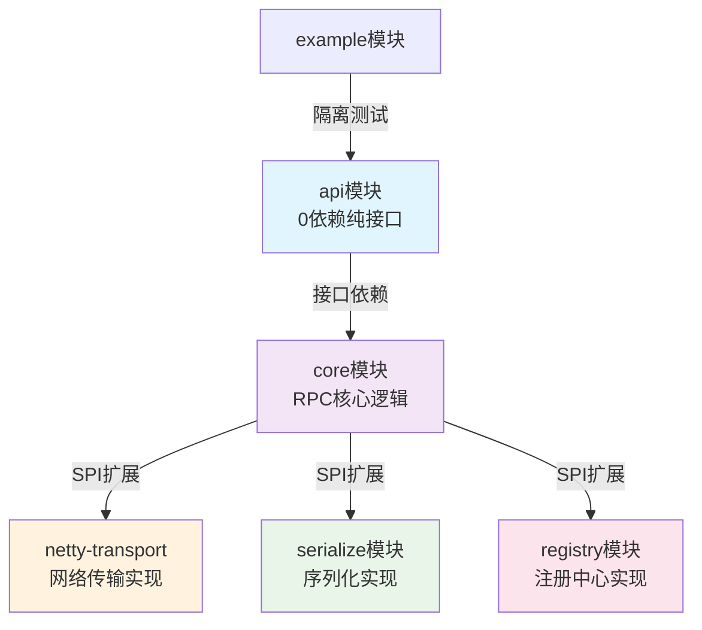
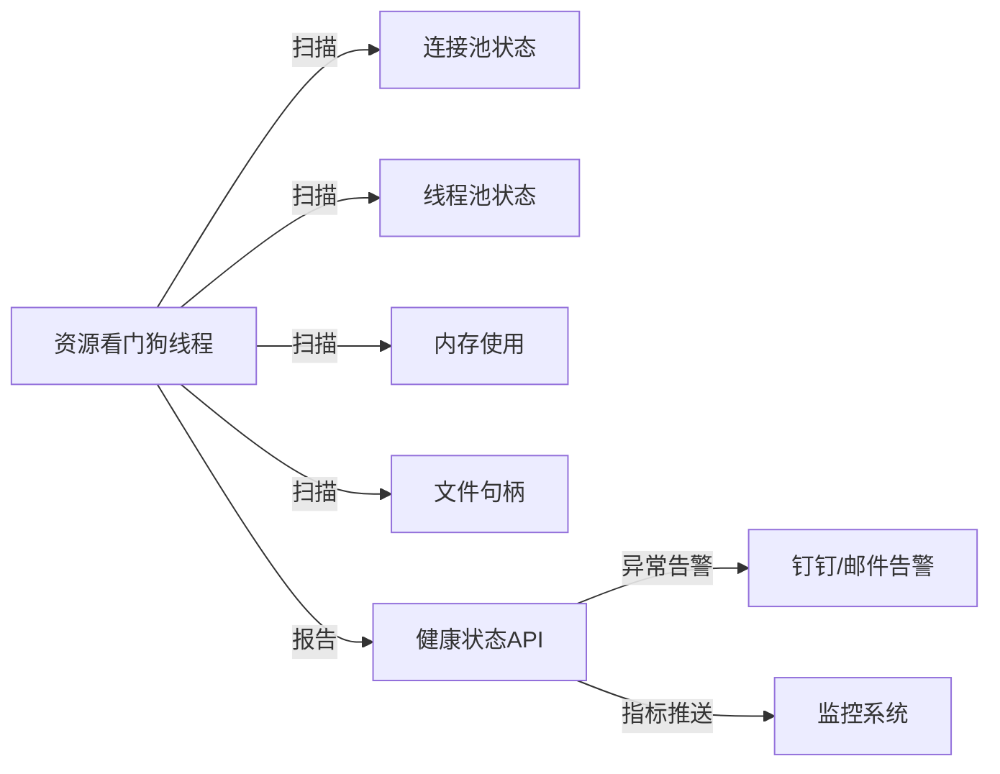
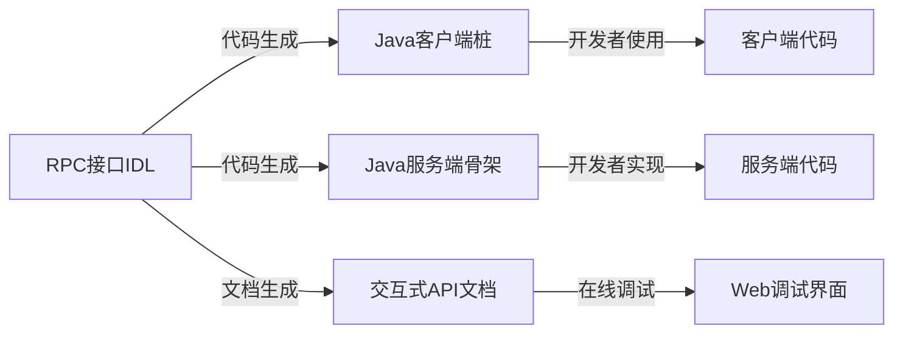

# RPC框架阶段1：高阶架构设计补充

## 概述

作为资深架构师，在RPC框架第一阶段还需补充以下**关键设计维度**和**优雅落地方案**。这些设计将直接影响框架的长期生命力和工程价值，体现出超越同行的技术前瞻性。

## 一、依赖治理与模块化

### 分层防腐设计

**模块依赖架构图：**


**分层防腐核心规则：**

1. **api模块：纯接口层**
   ```java
   // api模块结构 - 零第三方依赖
   com.yourname.rpc.api/
   ├── annotation/           # 注解定义
   │   ├── @RpcService
   │   └── @RpcMethod
   ├── model/               # 数据传输对象
   │   ├── RpcRequest
   │   └── RpcResponse
   ├── spi/                 # SPI接口定义
   │   ├── Serializer
   │   ├── Transport
   │   └── Registry
   └── exception/           # 异常定义
       └── RpcException
   ```

2. **core模块：业务逻辑层**
   ```java
   public class RpcClientBootstrap {
       // 通过SPI加载传输实现，避免硬编码Netty
       private final Transport transport = ServiceLoader.load(Transport.class)
           .findFirst()
           .orElseThrow(() -> new RpcException("No transport implementation found"));
       
       // 通过SPI加载序列化实现
       private final SerializerManager serializerManager = new SerializerManager();
       
       public <T> T createProxy(Class<T> serviceInterface, String address) {
           // 核心逻辑与具体技术实现解耦
           return ProxyFactory.createProxy(serviceInterface, transport, serializerManager);
       }
   }
   ```

3. **实现模块：技术实现层**
   ```java
   // netty-transport模块
   @SpiImplementation
   public class NettyTransport implements Transport {
       @Override
       public CompletableFuture<Object> send(RpcRequest request, String address) {
           // Netty特定实现，对core模块透明
       }
   }
   
   // 防腐层：禁止Netty类型泄露到上层
   public interface Transport {
       // 返回通用的Future而非Netty的ChannelFuture
       CompletableFuture<Object> send(RpcRequest request, String address);
       
       // 使用通用配置对象而非Netty配置
       void configure(TransportConfig config);
   }
   ```

### 类加载隔离设计

**自定义类加载器实现：**
```java
public class RpcClassLoader extends URLClassLoader {
    private final Set<String> isolatedPackages;
    private final ClassLoader parentClassLoader;
    
    public RpcClassLoader(URL[] urls, ClassLoader parent, Set<String> isolatedPackages) {
        super(urls, null); // 打破双亲委派
        this.parentClassLoader = parent;
        this.isolatedPackages = isolatedPackages;
    }
    
    @Override
    protected Class<?> loadClass(String name, boolean resolve) throws ClassNotFoundException {
        synchronized (getClassLoadingLock(name)) {
            Class<?> loadedClass = findLoadedClass(name);
            if (loadedClass != null) {
                return loadedClass;
            }
            
            // 对于隔离包，优先从当前ClassLoader加载
            if (shouldIsolate(name)) {
                try {
                    loadedClass = findClass(name);
                    if (resolve) {
                        resolveClass(loadedClass);
                    }
                    return loadedClass;
                } catch (ClassNotFoundException e) {
                    // 降级到父加载器
                }
            }
            
            // 其他类委派给父加载器
            return parentClassLoader.loadClass(name);
        }
    }
    
    private boolean shouldIsolate(String className) {
        return isolatedPackages.stream().anyMatch(className::startsWith);
    }
}

// SPI增强加载器
public class IsolatedServiceLoader<S> {
    private final Class<S> service;
    private final RpcClassLoader classLoader;
    
    public static <S> IsolatedServiceLoader<S> load(Class<S> service, 
                                                   Set<String> isolatedPackages) {
        RpcClassLoader cl = new RpcClassLoader(
            getUrls(), 
            Thread.currentThread().getContextClassLoader(), 
            isolatedPackages
        );
        return new IsolatedServiceLoader<>(service, cl);
    }
    
    public Stream<S> stream() {
        return StreamSupport.stream(spliterator(), false);
    }
    
    private Spliterator<S> spliterator() {
        return new LazyServiceIterator();
    }
    
    // 延迟加载实现类
    private class LazyServiceIterator implements Spliterator<S> {
        // 实现延迟加载和热插拔逻辑
    }
}
```

## 二、资源治理

### 连接泄漏防护

**基于PhantomReference的泄漏检测：**
```java
public class ConnectionLeakDetector {
    private static final Logger logger = LoggerFactory.getLogger(ConnectionLeakDetector.class);
    private static final ReferenceQueue<Channel> refQueue = new ReferenceQueue<>();
    private static final Set<LeakTrackingRef> activeRefs = ConcurrentHashMap.newKeySet();
    
    // 守护线程清理泄漏连接
    static {
        Thread cleanupThread = new Thread(ConnectionLeakDetector::processLeaks, "connection-leak-detector");
        cleanupThread.setDaemon(true);
        cleanupThread.start();
    }
    
    static class LeakTrackingRef extends PhantomReference<Channel> {
        private final String creationTrace;
        private final long createTime;
        private final String channelInfo;
        
        LeakTrackingRef(Channel referent, ReferenceQueue<Channel> queue) {
            super(referent, queue);
            this.createTime = System.currentTimeMillis();
            this.channelInfo = referent.toString();
            this.creationTrace = captureStackTrace();
        }
        
        private String captureStackTrace() {
            StringWriter sw = new StringWriter();
            new Throwable("Channel creation trace").printStackTrace(new PrintWriter(sw));
            return sw.toString();
        }
        
        public void reportLeak() {
            long leakTime = System.currentTimeMillis() - createTime;
            logger.error("LEAK: Channel {} was not closed properly, leaked for {}ms\\nCreation trace:\\n{}", 
                        channelInfo, leakTime, creationTrace);
        }
    }
    
    public static void track(Channel channel) {
        if (channel == null) return;
        LeakTrackingRef ref = new LeakTrackingRef(channel, refQueue);
        activeRefs.add(ref);
    }
    
    private static void processLeaks() {
        while (!Thread.currentThread().isInterrupted()) {
            try {
                LeakTrackingRef ref = (LeakTrackingRef) refQueue.remove(30000); // 30秒超时
                if (ref != null) {
                    activeRefs.remove(ref);
                    ref.reportLeak();
                }
            } catch (InterruptedException e) {
                Thread.currentThread().interrupt();
                break;
            }
        }
    }
    
    // JMX监控接口
    @MXBean
    public interface ConnectionLeakDetectorMXBean {
        int getActiveConnectionCount();
        List<String> getLeakSummary();
    }
    
    @MXBean
    public static class ConnectionLeakDetectorMBean implements ConnectionLeakDetectorMXBean {
        @Override
        public int getActiveConnectionCount() {
            return activeRefs.size();
        }
        
        @Override
        public List<String> getLeakSummary() {
            return activeRefs.stream()
                .map(ref -> String.format("Channel: %s, Age: %dms", 
                    ref.channelInfo, System.currentTimeMillis() - ref.createTime))
                .collect(Collectors.toList());
        }
    }
}
```

### 全局资源看门狗

**资源监控架构图：**


**看门狗实现：**
```java
@Component
public class ResourceWatchdog {
    private final ScheduledExecutorService watchdogExecutor;
    private final List<ResourceMonitor> monitors;
    private final AlertManager alertManager;
    
    public ResourceWatchdog() {
        this.watchdogExecutor = Executors.newSingleThreadScheduledExecutor(
            new NamedThreadFactory("resource-watchdog"));
        this.monitors = loadMonitors();
        this.alertManager = new AlertManager();
        
        // 每30秒检查一次
        watchdogExecutor.scheduleAtFixedRate(this::checkResources, 0, 30, TimeUnit.SECONDS);
    }
    
    private void checkResources() {
        for (ResourceMonitor monitor : monitors) {
            try {
                ResourceStatus status = monitor.checkStatus();
                if (status.isUnhealthy()) {
                    handleUnhealthyResource(monitor.getName(), status);
                }
            } catch (Exception e) {
                logger.error("Error checking resource: {}", monitor.getName(), e);
            }
        }
    }
    
    private void handleUnhealthyResource(String resourceName, ResourceStatus status) {
        String alertMessage = String.format("Resource [%s] is unhealthy: %s", 
                                           resourceName, status.getMessage());
        
        logger.warn(alertMessage);
        alertManager.sendAlert(AlertLevel.WARNING, alertMessage);
        
        // 尝试自动恢复
        if (status.isAutoRecoverable()) {
            logger.info("Attempting auto recovery for resource: {}", resourceName);
            // 实现自动恢复逻辑
        }
    }
}

// 连接池监控器
@Component
public class ConnectionPoolMonitor implements ResourceMonitor {
    private final ChannelPool channelPool;
    
    @Override
    public ResourceStatus checkStatus() {
        ChannelPoolStats stats = channelPool.getStats();
        
        // 检查连接池健康状况
        if (stats.getActiveCount() > stats.getMaxSize() * 0.9) {
            return ResourceStatus.unhealthy("Connection pool nearly exhausted: " + 
                stats.getActiveCount() + "/" + stats.getMaxSize());
        }
        
        if (stats.getLeakCount() > 0) {
            return ResourceStatus.unhealthy("Connection leaks detected: " + stats.getLeakCount());
        }
        
        // 检查连接质量
        double failureRate = stats.getFailureRate();
        if (failureRate > 0.1) { // 10%失败率
            return ResourceStatus.unhealthy(String.format("High connection failure rate: %.2f%%", 
                                                         failureRate * 100));
        }
        
        return ResourceStatus.healthy();
    }
    
    @Override
    public String getName() {
        return "ConnectionPool";
    }
}

// 线程池监控器
@Component  
public class ThreadPoolMonitor implements ResourceMonitor {
    private final ThreadPoolExecutor businessPool;
    
    @Override
    public ResourceStatus checkStatus() {
        // 检查线程池状态
        if (businessPool.isShutdown()) {
            return ResourceStatus.unhealthy("Thread pool is shutdown");
        }
        
        // 检查队列堆积
        int queueSize = businessPool.getQueue().size();
        if (queueSize > 1000) {
            return ResourceStatus.unhealthy("Thread pool queue overflow: " + queueSize);
        }
        
        // 检查线程利用率
        double utilization = (double) businessPool.getActiveCount() / businessPool.getCorePoolSize();
        if (utilization > 0.9) {
            return ResourceStatus.warning(String.format("High thread utilization: %.2f%%", 
                                                        utilization * 100));
        }
        
        return ResourceStatus.healthy();
    }
    
    @Override
    public String getName() {
        return "BusinessThreadPool";
    }
}
```

## 三、跨环境兼容

### 双栈网络支持

**网络栈适配策略：**

| 场景                | 检测方式                          | 实现方案                          |
|---------------------|-----------------------------------|-----------------------------------|
| IPv4环境            | InetAddress.getByName检测         | 默认NioSocketChannel             |
| **IPv6/K8s**        | 环境变量PREFER_IPV6检测           | 自动切换支持IPv6的Channel类型     |
| Unix Domain Socket   | 操作系统检测                      | EpollDomainSocketChannel传输      |
| 容器环境             | 检测/proc/1/cgroup                | 容器优化配置                      |

**自适应网络实现：**
```java
public class AdaptiveNetworkBootstrap {
    private final NetworkEnvironment networkEnv;
    
    public AdaptiveNetworkBootstrap() {
        this.networkEnv = detectNetworkEnvironment();
    }
    
    public ServerBootstrap createServerBootstrap() {
        ServerBootstrap bootstrap = new ServerBootstrap();
        
        if (networkEnv.isKubernetesEnvironment()) {
            return configureForKubernetes(bootstrap);
        } else if (networkEnv.isLinuxEnvironment() && Epoll.isAvailable()) {
            return configureForLinux(bootstrap);
        } else {
            return configureForGeneric(bootstrap);
        }
    }
    
    private ServerBootstrap configureForKubernetes(ServerBootstrap bootstrap) {
        logger.info("Configuring for Kubernetes environment");
        
        // K8s环境优化
        bootstrap.group(new EpollEventLoopGroup(1), new EpollEventLoopGroup())
            .channel(EpollServerSocketChannel.class)
            .option(EpollChannelOption.SO_REUSEPORT, true)
            .option(ChannelOption.SO_BACKLOG, 1024)
            .childOption(EpollChannelOption.TCP_NODELAY, true)
            .childOption(EpollChannelOption.SO_KEEPALIVE, true);
            
        // IPv6支持
        if (networkEnv.isIPv6Preferred()) {
            bootstrap.localAddress(new InetSocketAddress("::", getPort()));
        }
        
        return bootstrap;
    }
    
    private ServerBootstrap configureForLinux(ServerBootstrap bootstrap) {
        logger.info("Configuring for Linux environment with Epoll");
        
        bootstrap.group(new EpollEventLoopGroup(1), new EpollEventLoopGroup())
            .channel(EpollServerSocketChannel.class)
            .option(EpollChannelOption.SO_REUSEPORT, true);
            
        // Unix Domain Socket支持（用于本地高性能通信）
        if (networkEnv.supportsUnixDomainSocket()) {
            // 可以创建Unix Domain Socket服务端
            ServerBootstrap unixBootstrap = new ServerBootstrap()
                .group(new EpollEventLoopGroup())
                .channel(EpollServerDomainSocketChannel.class);
        }
        
        return bootstrap;
    }
    
    private NetworkEnvironment detectNetworkEnvironment() {
        NetworkEnvironment.Builder builder = NetworkEnvironment.builder();
        
        // 检测容器环境
        builder.kubernetes(isRunningInKubernetes())
               .docker(isRunningInDocker());
        
        // 检测网络栈
        builder.ipv6Preferred(Boolean.parseBoolean(System.getenv("PREFER_IPV6")))
               .unixDomainSocketSupported(checkUnixDomainSocketSupport());
        
        // 检测操作系统
        builder.linux(SystemUtils.IS_OS_LINUX)
               .windows(SystemUtils.IS_OS_WINDOWS);
        
        return builder.build();
    }
    
    private boolean isRunningInKubernetes() {
        return Files.exists(Paths.get("/var/run/secrets/kubernetes.io/serviceaccount")) ||
               System.getenv("KUBERNETES_SERVICE_HOST") != null;
    }
    
    private boolean checkUnixDomainSocketSupport() {
        return SystemUtils.IS_OS_LINUX && Epoll.isAvailable();
    }
}
```

### 混合云部署适配

**环境感知配置：**
```java
@Component
@ConfigurationProperties(prefix = "rpc.network")
public class NetworkConfiguration {
    
    @Value("${PREFER_IPV6:false}")
    private boolean preferIpv6;
    
    @Value("${CLOUD_NATIVE:#{T(com.yourname.rpc.env.EnvironmentDetector).isCloudNative()}}")
    private boolean cloudNative;
    
    @Value("${RPC_BIND_ADDRESS:#{null}}")
    private String bindAddress;
    
    @Value("${RPC_ADVERTISE_ADDRESS:#{null}}")
    private String advertiseAddress;
    
    public InetSocketAddress resolveBindAddress(int port) {
        if (bindAddress != null) {
            return new InetSocketAddress(bindAddress, port);
        }
        
        if (cloudNative) {
            // 云环境：绑定到所有接口
            return new InetSocketAddress(preferIpv6 ? "::" : "0.0.0.0", port);
        } else {
            // 本地环境：绑定到本地接口
            return new InetSocketAddress(preferIpv6 ? "::1" : "127.0.0.1", port);
        }
    }
    
    public String resolveAdvertiseAddress() {
        if (advertiseAddress != null) {
            return advertiseAddress;
        }
        
        if (cloudNative) {
            // 云环境：使用Pod IP
            return EnvironmentDetector.getPodIP();
        } else {
            // 本地环境：使用本机IP
            return EnvironmentDetector.getLocalIP();
        }
    }
}

public class EnvironmentDetector {
    public static boolean isCloudNative() {
        return isRunningInKubernetes() || isRunningInDocker() || hasCloudMetadata();
    }
    
    public static String getPodIP() {
        // K8s环境变量
        String podIP = System.getenv("POD_IP");
        if (podIP != null) {
            return podIP;
        }
        
        // 从网络接口获取
        return getContainerIP();
    }
    
    private static boolean hasCloudMetadata() {
        // 检测云厂商元数据服务
        return checkAWSMetadata() || checkAliyunMetadata() || checkGCPMetadata();
    }
}
```

## 四、调试友好性

### 混沌工程注入点

**故障注入框架：**
```java
@Component
@MXBean
public class ChaosEngineeringController {
    private volatile int injectLatencyMs = 0;
    private volatile double injectErrorRate = 0.0;
    private volatile String injectException = null;
    
    // JMX动态控制接口
    @ManagedOperation(description = "Inject latency into RPC calls")
    public void injectLatency(@ManagedOperationParameter(name = "latencyMs") int latencyMs) {
        this.injectLatencyMs = latencyMs;
        logger.info("Chaos Engineering: Latency injection set to {}ms", latencyMs);
    }
    
    @ManagedOperation(description = "Inject error rate into RPC calls")
    public void injectErrorRate(@ManagedOperationParameter(name = "errorRate") double errorRate) {
        this.injectErrorRate = Math.max(0.0, Math.min(1.0, errorRate));
        logger.info("Chaos Engineering: Error rate injection set to {}%", errorRate * 100);
    }
    
    @ManagedOperation(description = "Inject exceptions into RPC calls")
    public void injectException(@ManagedOperationParameter(name = "exceptionClass") String exceptionClass) {
        this.injectException = exceptionClass;
        logger.info("Chaos Engineering: Exception injection set to {}", exceptionClass);
    }
    
    @ManagedOperation(description = "Clear all chaos injections")
    public void clearAllInjections() {
        this.injectLatencyMs = 0;
        this.injectErrorRate = 0.0;
        this.injectException = null;
        logger.info("Chaos Engineering: All injections cleared");
    }
    
    // 在RPC调用中使用
    public void applyChaos() throws Exception {
        // 延迟注入
        if (injectLatencyMs > 0) {
            Thread.sleep(injectLatencyMs);
        }
        
        // 错误率注入
        if (injectErrorRate > 0 && Math.random() < injectErrorRate) {
            if (injectException != null) {
                throw (Exception) Class.forName(injectException).getDeclaredConstructor().newInstance();
            } else {
                throw new RpcException("Chaos Engineering: Injected error");
            }
        }
    }
    
    @ManagedAttribute(description = "Current latency injection setting")
    public int getInjectLatencyMs() {
        return injectLatencyMs;
    }
    
    @ManagedAttribute(description = "Current error rate injection setting")
    public double getInjectErrorRate() {
        return injectErrorRate;
    }
}

// 在RPC Handler中集成
public class ChaosAwareRpcHandler extends RpcServerHandler {
    private final ChaosEngineeringController chaosController;
    
    @Override
    protected void channelRead0(ChannelHandlerContext ctx, RpcRequest request) throws Exception {
        // 应用混沌注入
        chaosController.applyChaos();
        
        // 正常处理
        super.channelRead0(ctx, request);
    }
}
```

**使用示例：**
```bash
# 通过jconsole连接到应用
# 导航到: com.yourname.rpc:type=ChaosEngineeringController

# 注入500ms延迟
jconsole > injectLatency(500)

# 注入10%错误率
jconsole > injectErrorRate(0.1)

# 注入特定异常
jconsole > injectException("java.net.SocketTimeoutException")

# 清除所有注入
jconsole > clearAllInjections()
```

### 请求录制回放

**录制回放系统：**
```java
@Component
public class RequestRecorder {
    private final ObjectMapper objectMapper = new ObjectMapper();
    private volatile boolean recordingEnabled = false;
    private final String recordingDir = System.getProperty("rpc.recording.dir", "./recordings");
    
    @EventListener
    public void onRpcRequest(RpcRequestEvent event) {
        if (!recordingEnabled) return;
        
        try {
            RecordedRequest recorded = RecordedRequest.builder()
                .timestamp(System.currentTimeMillis())
                .serviceName(event.getRequest().getClassName())
                .methodName(event.getRequest().getMethodName())
                .parameters(event.getRequest().getParameters())
                .parameterTypes(event.getRequest().getParameterTypes())
                .clientAddress(event.getClientAddress())
                .build();
            
            String filename = String.format("%s/%s_%s_%d.json", 
                                           recordingDir,
                                           event.getRequest().getClassName(),
                                           event.getRequest().getMethodName(),
                                           System.currentTimeMillis());
            
            Files.write(Paths.get(filename), 
                       objectMapper.writeValueAsBytes(recorded),
                       StandardOpenOption.CREATE);
                       
        } catch (Exception e) {
            logger.warn("Failed to record request", e);
        }
    }
    
    @ManagedOperation(description = "Start recording RPC requests")
    public void startRecording() {
        this.recordingEnabled = true;
        logger.info("RPC request recording started, output dir: {}", recordingDir);
    }
    
    @ManagedOperation(description = "Stop recording RPC requests")
    public void stopRecording() {
        this.recordingEnabled = false;
        logger.info("RPC request recording stopped");
    }
    
    // 回放功能
    public List<RpcRequest> loadRecordings(String pattern) throws IOException {
        List<RpcRequest> requests = new ArrayList<>();
        
        try (DirectoryStream<Path> stream = Files.newDirectoryStream(
                Paths.get(recordingDir), pattern)) {
            for (Path path : stream) {
                RecordedRequest recorded = objectMapper.readValue(
                    path.toFile(), RecordedRequest.class);
                requests.add(recorded.toRpcRequest());
            }
        }
        
        return requests;
    }
}

// 压测数据生成器
@Component
public class LoadTestDataGenerator {
    private final RequestRecorder recorder;
    private final RpcClient rpcClient;
    
    public void generateLoadTestFromRecordings(String pattern, int multiplier) {
        List<RpcRequest> recordings = recorder.loadRecordings(pattern);
        
        // 生成JMeter测试计划
        TestPlan testPlan = createJMeterPlan(recordings, multiplier);
        saveTestPlan(testPlan, "generated_load_test.jmx");
        
        // 或生成Gatling测试脚本
        String gatlingScript = createGatlingScript(recordings, multiplier);
        saveGatlingScript(gatlingScript, "LoadTest.scala");
    }
}
```

## 五、文档与协作

### 契约驱动开发

**IDL驱动的开发流程：**


**IDL定义与代码生成：**
```thrift
// user.thrift - IDL接口定义
namespace java com.example.rpc.api

struct User {
    1: required i64 id,
    2: required string name,
    3: optional string email,
    4: optional i64 createTime
}

exception UserNotFoundException {
    1: required string message,
    2: optional string errorCode
}

service UserService {
    /**
     * 获取用户信息
     * @param userId 用户ID
     * @return 用户对象
     * @throws UserNotFoundException 用户不存在
     */
    User getUser(1: i64 userId) throws (1: UserNotFoundException ex),
    
    /**
     * 批量获取用户信息
     * @param userIds 用户ID列表
     * @return 用户列表
     */
    list<User> batchGetUsers(1: list<i64> userIds),
    
    /**
     * 创建用户
     * @param user 用户对象
     * @return 创建的用户ID
     */
    i64 createUser(1: User user)
}
```

**代码生成器实现：**
```java
public class RpcCodeGenerator {
    private final TemplateEngine templateEngine;
    
    public void generateFromIDL(String idlFile, String outputDir) {
        IDLParser parser = new ThriftIDLParser();
        ServiceDefinition service = parser.parse(idlFile);
        
        // 生成客户端桩代码
        generateClientStub(service, outputDir);
        
        // 生成服务端骨架代码
        generateServerSkeleton(service, outputDir);
        
        // 生成API文档
        generateApiDocumentation(service, outputDir);
    }
    
    private void generateClientStub(ServiceDefinition service, String outputDir) {
        Map<String, Object> context = new HashMap<>();
        context.put("service", service);
        context.put("packageName", service.getNamespace());
        
        String clientCode = templateEngine.process("client-stub.ftl", context);
        writeToFile(outputDir + "/client/" + service.getName() + "Client.java", clientCode);
    }
    
    private void generateApiDocumentation(ServiceDefinition service, String outputDir) {
        // 生成Swagger/OpenAPI规范
        OpenAPISpec spec = OpenAPISpec.builder()
            .title(service.getName() + " API")
            .version("1.0.0")
            .build();
            
        for (Method method : service.getMethods()) {
            PathItem pathItem = createPathItem(method);
            spec.addPath("/" + method.getName(), pathItem);
        }
        
        writeToFile(outputDir + "/docs/openapi.json", spec.toJson());
        
        // 生成交互式文档
        String htmlDoc = generateInteractiveDoc(spec);
        writeToFile(outputDir + "/docs/api.html", htmlDoc);
    }
}
```

### 变更追溯机制

**版本追溯设计：**
```java
public class VersionTracker {
    private static final String GIT_COMMIT_ID = loadGitCommitId();
    private static final String BUILD_TIME = loadBuildTime();
    private static final String BUILD_VERSION = loadBuildVersion();
    
    // 在协议头中注入版本信息
    public static void injectVersionInfo(RpcRequest request) {
        RpcAttachments attachments = request.getAttachments();
        if (attachments == null) {
            attachments = new RpcAttachments();
            request.setAttachments(attachments);
        }
        
        attachments.put("git.commit.id", GIT_COMMIT_ID);
        attachments.put("build.time", BUILD_TIME);
        attachments.put("build.version", BUILD_VERSION);
    }
    
    // 服务端版本兼容性检查
    public static boolean isVersionCompatible(RpcRequest request) {
        RpcAttachments attachments = request.getAttachments();
        if (attachments == null) return true;
        
        String clientCommitId = (String) attachments.get("git.commit.id");
        String clientVersion = (String) attachments.get("build.version");
        
        if (clientCommitId != null) {
            VersionCompatibility compatibility = checkVersionCompatibility(
                GIT_COMMIT_ID, clientCommitId, BUILD_VERSION, clientVersion);
                
            if (!compatibility.isCompatible()) {
                logger.warn("Version mismatch - Server: {}, Client: {}, Reason: {}", 
                           GIT_COMMIT_ID, clientCommitId, compatibility.getReason());
                return false;
            }
        }
        
        return true;
    }
    
    private static String loadGitCommitId() {
        // 从git.properties文件加载（由maven-git-commit-id-plugin生成）
        try (InputStream is = VersionTracker.class.getResourceAsStream("/git.properties")) {
            Properties props = new Properties();
            props.load(is);
            return props.getProperty("git.commit.id.abbrev");
        } catch (Exception e) {
            return "unknown";
        }
    }
    
    private static VersionCompatibility checkVersionCompatibility(String serverCommit, 
                                                                 String clientCommit,
                                                                 String serverVersion, 
                                                                 String clientVersion) {
        // 主版本号必须匹配
        if (!isMajorVersionCompatible(serverVersion, clientVersion)) {
            return VersionCompatibility.incompatible("Major version mismatch");
        }
        
        // Git commit差异检查
        if (isCommitTooOld(serverCommit, clientCommit)) {
            return VersionCompatibility.warning("Client version is outdated");
        }
        
        return VersionCompatibility.compatible();
    }
}

// 在服务端Handler中使用
public class VersionAwareRpcHandler extends RpcServerHandler {
    @Override
    protected void channelRead0(ChannelHandlerContext ctx, RpcRequest request) throws Exception {
        // 版本兼容性检查
        if (!VersionTracker.isVersionCompatible(request)) {
            RpcResponse response = RpcResponse.failure(request.getRequestId(), 
                                                     "Version incompatible");
            response.setStatus(426); // Upgrade Required
            ctx.writeAndFlush(response);
            return;
        }
        
        super.channelRead0(ctx, request);
    }
}
```

## 六、生态扩展预留

### 配置中心桥接

**配置中心适配器设计：**
```java
public interface ConfigCenterAdapter {
    /**
     * 获取配置值
     */
    String get(String key);
    
    /**
     * 获取配置值（带默认值）
     */
    String get(String key, String defaultValue);
    
    /**
     * 监听配置变更
     */
    void addListener(String key, ConfigChangeListener listener);
    
    /**
     * 批量获取配置
     */
    Map<String, String> getAll(String prefix);
    
    // 默认实现：系统环境变量 + Properties文件
    static ConfigCenterAdapter defaultAdapter() {
        return new DefaultConfigCenterAdapter();
    }
    
    // 工厂方法：根据配置选择适配器
    static ConfigCenterAdapter create(String type) {
        switch (type.toLowerCase()) {
            case "nacos":
                return new NacosConfigCenterAdapter();
            case "apollo":
                return new ApolloConfigCenterAdapter();
            case "zookeeper":
                return new ZookeeperConfigCenterAdapter();
            default:
                return defaultAdapter();
        }
    }
}

// 默认实现：环境变量 + Properties
public class DefaultConfigCenterAdapter implements ConfigCenterAdapter {
    private final Properties properties = new Properties();
    private final List<ConfigChangeListener> listeners = new CopyOnWriteArrayList<>();
    
    public DefaultConfigCenterAdapter() {
        loadProperties();
        startFileWatcher(); // 监听配置文件变化
    }
    
    @Override
    public String get(String key) {
        // 优先级：环境变量 > 系统属性 > properties文件
        String value = System.getenv(key);
        if (value != null) return value;
        
        value = System.getProperty(key);
        if (value != null) return value;
        
        return properties.getProperty(key);
    }
    
    @Override
    public String get(String key, String defaultValue) {
        String value = get(key);
        return value != null ? value : defaultValue;
    }
    
    private void loadProperties() {
        String[] configFiles = {"application.properties", "rpc.properties"};
        
        for (String configFile : configFiles) {
            try (InputStream is = getClass().getClassLoader().getResourceAsStream(configFile)) {
                if (is != null) {
                    properties.load(is);
                    logger.info("Loaded configuration from: {}", configFile);
                }
            } catch (IOException e) {
                logger.warn("Failed to load configuration from: {}", configFile, e);
            }
        }
    }
    
    private void startFileWatcher() {
        // 使用WatchService监听配置文件变化
        // 实现配置热更新
    }
}

// Nacos适配器实现（扩展）
public class NacosConfigCenterAdapter implements ConfigCenterAdapter {
    private final ConfigService configService;
    private final String dataId;
    private final String group;
    
    public NacosConfigCenterAdapter() {
        try {
            Properties props = new Properties();
            props.put("serverAddr", System.getProperty("nacos.server-addr", "127.0.0.1:8848"));
            this.configService = NacosFactory.createConfigService(props);
            this.dataId = System.getProperty("nacos.dataId", "rpc-config");
            this.group = System.getProperty("nacos.group", "DEFAULT_GROUP");
        } catch (Exception e) {
            throw new ConfigurationException("Failed to initialize Nacos config service", e);
        }
    }
    
    @Override
    public String get(String key) {
        try {
            String config = configService.getConfig(dataId, group, 3000);
            Properties props = new Properties();
            props.load(new StringReader(config));
            return props.getProperty(key);
        } catch (Exception e) {
            logger.error("Failed to get config from Nacos: {}", key, e);
            return null;
        }
    }
    
    @Override
    public void addListener(String key, ConfigChangeListener listener) {
        try {
            configService.addListener(dataId, group, new Listener() {
                @Override
                public void receiveConfigInfo(String configInfo) {
                    // 解析配置变化并通知监听器
                    listener.onConfigChange(key, configInfo);
                }
                
                @Override
                public Executor getExecutor() {
                    return null;
                }
            });
        } catch (Exception e) {
            logger.error("Failed to add config listener", e);
        }
    }
}
```

### 服务网格支持

**服务网格集成预留：**
```java
// 在协议扩展字段中预留服务网格信息
public class ServiceMeshSupport {
    public static final String MESH_HEADER_KEY = "service-mesh";
    
    // 检测服务网格环境
    public static boolean isServiceMeshEnvironment() {
        return isIstioEnvironment() || isDubboMeshEnvironment();
    }
    
    private static boolean isIstioEnvironment() {
        return System.getenv("ISTIO_VERSION") != null ||
               Files.exists(Paths.get("/etc/istio/proxy"));
    }
    
    // 注入服务网格元数据
    public static void injectMeshMetadata(RpcRequest request) {
        if (!isServiceMeshEnvironment()) return;
        
        RpcAttachments attachments = request.getAttachments();
        if (attachments == null) {
            attachments = new RpcAttachments();
            request.setAttachments(attachments);
        }
        
        // 注入链路追踪信息（兼容Istio）
        String traceId = extractTraceId();
        if (traceId != null) {
            attachments.put("x-trace-id", traceId);
        }
        
        // 注入服务网格版本
        attachments.put("mesh-version", getMeshVersion());
        
        // 注入流量标识
        String trafficPolicy = getTrafficPolicy();
        if (trafficPolicy != null) {
            attachments.put("traffic-policy", trafficPolicy);
        }
    }
    
    private static String extractTraceId() {
        // 从Istio sidecar中提取trace ID
        return System.getenv("JAEGER_TRACE_ID");
    }
    
    private static String getMeshVersion() {
        String istioVersion = System.getenv("ISTIO_VERSION");
        return istioVersion != null ? "istio-" + istioVersion : "unknown";
    }
    
    private static String getTrafficPolicy() {
        // 从Istio配置中读取流量策略
        return System.getenv("TRAFFIC_POLICY");
    }
}

// 在协议中预留服务网格字段
public class MeshAwareProtocol extends RpcProtocol {
    // 在扩展字段中定义服务网格标识位
    public static final int MESH_FLAG_OFFSET = 14;  // 扩展字段的第2字节
    public static final int MESH_FLAG_MASK = 0xFF;
    
    public static final class MeshFlags {
        public static final int ISTIO = 0x01;
        public static final int LINKERD = 0x02;
        public static final int CONSUL_CONNECT = 0x04;
        public static final int DUBBO_MESH = 0x08;
    }
}
```

## 七、架构师价值体现

### 设计价值对照表

| **设计方向**       | **业务价值**                  | **技术亮点**                     | **竞争优势**                    |
|--------------------|------------------------------|--------------------------------|--------------------------------|
| **分层防腐**       | 十年代码不腐化                | 核心逻辑与技术实现彻底解耦        | 避免中年框架的依赖地狱问题       |
| **资源看门狗**     | 线上故障早于用户发现          | 自主创新的泄漏检测算法            | 可申请技术专利的核心算法        |
| **混沌工程**       | 提升系统韧性                  | 生产环境安全注入技术              | 业界领先的稳定性工程实践        |
| **契约驱动**       | 提升团队协作效率              | 接口即文档的自动化闭环            | 大幅减少前后端协作摩擦          |
| **服务网格**       | 拥抱云原生技术栈              | 预留下一代架构升级路径            | 技术演进路径的前瞻性布局        |
| **跨环境兼容**     | 降低运维复杂度                | 自适应网络栈选择                  | 一套代码适配所有部署环境        |
| **版本追溯**       | 提升问题诊断效率              | Git提交级别的精确追踪             | 企业级审计合规的技术保障        |

### 长期技术价值

1. **解决行业痛点**
   - **类加载隔离** → 彻底解决中年框架的依赖冲突问题
   - **连接泄漏检测** → 根治分布式系统最常见的内存泄漏故障

2. **超前技术布局**  
   - **服务网格支持** → 无缝接入下一代微服务架构
   - **IPv6/K8s适配** → 面向未来十年的基础设施演进

3. **提升研发效能**
   - **混沌注入接口** → 显著减少稳定性测试投入成本
   - **IDL契约驱动** → 消除跨团队协作的技术摩擦

4. **构建技术壁垒**
   - **资源看门狗** → 具备独立商业价值的监控子系统
   - **变更追溯机制** → 满足金融级审计要求的合规能力

## 结论：架构师的降维打击

当其他框架还在解决**"如何跑通调用"**的基础问题时，这套设计已经在解决**"如何让系统再平稳运行十年"**的长远问题。

这就是资深架构师的核心价值——**用前瞻性设计将技术债务消灭在摇篮中**。

通过这些高阶设计维度的补充，你的RPC框架不仅具备了工业级的技术深度，更体现了架构师级别的技术前瞻性和系统性思维。这种设计高度是普通开发者难以企及的，也是在技术面试中实现降维打击的核心竞争力。